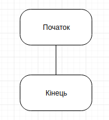
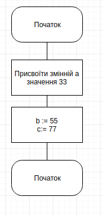
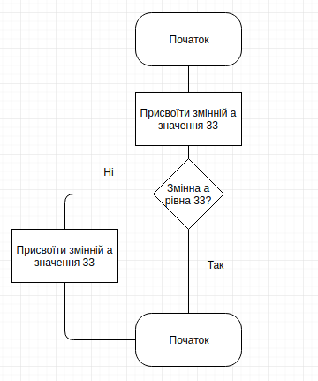
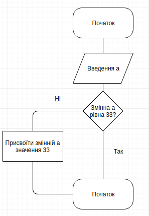
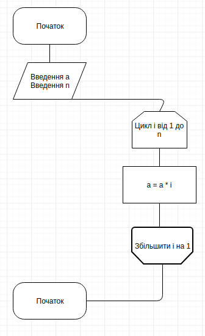
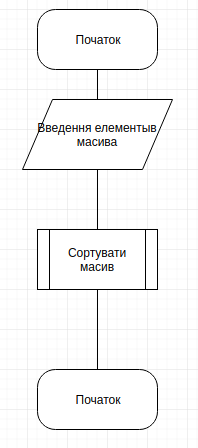
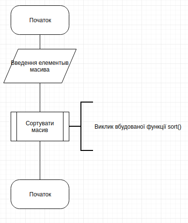

### Вступ

Головне завдання програміста: переводити думки з повсякденної мови спілкування на мову комп'ютерів. Початківцям програмістам досить важко це робити. Для подолання цих труднощів призначені блок-схеми і псевдокод.

### Псевдокод

Що таке псевдокод? Це запис команд комп'ютера звичайною людською мовою. В результаті програміст отримує проміжну форму між повсякденною мовою і мовою програмування.

Псевдокод використовується для демонстрації того, як комп'ютерний алгоритм може і повинен працювати. Інженери часто використовують псевдокод як проміжний етап у програмуванні - між стадією планування і стадією написання працюючого коду. Хороший псевдокод може перетворитися в коментарі до фінальної версії програми і буде допомагати програмісту виправляти помилки в майбутньому або корегувати код.


Псевдокод суб'єктивний і не стандартизований. У ньому немає чітко встановленого синтаксису - є тільки негласне правило використовувати стандартні конструкції, які інші програмісти могли б зрозуміти без особливих проблем.

```
Якщо координата x юніта менше одиниці, то зробити x рівним одиниці.
Якщо координата y юніта менше одиниці, то зробити y рівним одиниці.
Якщо координата x юніта більше 64, то зробити x рівним 64.
Якщо координата y юніта більше 64, то зробити y рівним 64.
```

```cpp
if (unit.x < 1) unit.x = 1;
if (unit.y < 1) unit.y = 1;
if (unit.x > 64) unit.x = 64;
if (unit.y > 64) unit.y = 64;
```

Приклад:

- відкрити файл
- в кожному рядку файлу:
    - знайти словосполучення
    - видалити словосполучення
    - вставити інше словосполучення
- закрити файл

### Що таке блок - схема?

**Блок-схема** (рос. блок-схема, англ. block scheme, flowchart, block diagram, flow diagram; нім. Block-schema) — представлення алгоритму розв'язування або аналізу задачі за допомогою геометричних елементів (блоків), які позначають операції, потік, дані тощо.

Блок - схеми регламентуються [ГОСТ 19.701-90](http://vsegost.com/Catalog/28/28346.shtml)

Фігури, які використовуються:

1. **Термінатор**:



Елемент відображає вхід у зовнішнє середовище або вихід з нього (найчастіше застосування - початок і кінець програми). Всередині фігури записується відповідна дія.

2. **Процес**:



Елемент відображає одну або кількох операцій, обробку даних будь-якого виду (зміна значення даних, форми подання, розташування). Всередині фігури записують безпосередньо самі операції.

3. **Умова**:



Елемент відображає обробку умови, рішення або функцію перемикального типу з одним входом і двома або більше альтернативними виходами, з яких тільки один може бути обраний після обчислення умов, визначених всередині цього елементу. Вхід в елемент позначається лінією, що входить зазвичай у верхню вершину елементу. Якщо виходів два чи три то зазвичай кожен вихід позначається лінією, що виходить з решти вершин (бічних і нижньої). Якщо виходів більше трьох, то їх слід показувати однією лінією, що виходить з вершини (частіше нижньої) елемента, яка потім розгалужується. Відповідні результати обчислень можуть записуватися поруч з лініями, що відображають ці шляхи.

4. ввід/вивід



Елемент відображає перетворення у форму, придатну для обробки (введення) або відображення результатів обробки (виведення). Цей символ не визначає носія даних (для вказівки типу носія даних використовуються специфічні символи).

5. Межа циклу



Елемент складається з двох частин - відповідно, початок і кінець циклу - операції, що виконуються всередині циклу, розміщуються між ними. Умови циклу і збільшення записуються всередині символу початку або кінця циклу - в залежності від типу організації циклу. Часто для зображення на блок-схемі циклу замість цього символу використовують символ рішення, вказуючи в ньому умову, а одну з ліній виходу замикають вище в блок-схемі (перед операціями циклу).

6. Функція (процедура)



Елемент відображає виконання процесу, що складається з однієї або кількох операцій, що визначені в іншому місці програми (у підпрограмі, модулі). Всередині символу записується назва процесу і передані в нього дані.

7. Коментар



Елемент використовується для детальнішої інформації про кроки, процесу або групи процесів. Опис поміщається з боку квадратної дужки і охоплюється нею по всій висоті. Пунктирна лінія йде до описуваного елементу, або групи елементів (при цьому група виділяється замкнутою пунктирною лінією). Також символ коментаря слід використовувати в тих випадках, коли обсяг тексту в будь-якому іншому символі (наприклад, символ процесу, символ даних та ін) перевищує його обсяг.


### Практика

> Для побудови блок-схем зручно використовувати сервіс Draw.io

**Завдання:**

Вхід: список рядків, які можуть повторюватися.
Вихід: рядок, який найчастіше повторюється.

Наприклад:

```
Input: ["qw", "da", "me", "da"]
Output: da
```

1. Написати псевдокод рішення.
2. Розробити блок - схему рішення.