## PIP


### PIP
pip - це система управління пакетами, яка використовується для установки і управління програмними пакетами, написаними на Python.

Якщо Ви устанавлювали Python із офіційного сайту, pip вже приустній у системі. Для перевірки достатньо виконати команду:

```bash
pip -V
```


### PIP.Встановлення пакетів глобально

Пакети можна знайти на [pypi](https://pypi.org/)


### PIP.Встановлення пакетів глобально
Щоб встановити пакет, потрібно скористатися командою pip install:

```bash
pip install [packagename]
```

Або встановити конкретну версію пакету:

```bash
pip install [packagename==version]
```

> Всі пакети будуть встановлені глобально і будуть доступні всюди. Директорія, де зберігаються пакети різна взалежності від операційної системи, наприклад, для linux - /usr/local/lib/python2.7/site-packages


### PIP.Встановлення пакетів глобально
Наприклад установимо пакет numpy:

```bash
pip install numpy
```


> Встановлючи пакети глобально, можливо доведеться мати права адміністратора. Для Windows відкрити термінал від імені адміністратора. Для Linux, Mac використати команду sudo.


### PIP.Встановлення пакетів глобально
Щоб використати пакет достатньо його імпортувати:

```py
import numpy
```


### PIP.Встановлення пакетів глобально
Щоб видалити пакет потрібно виконати команду:

```bash
pip uninstall [packagename]
```


## Virtualenv


### virtualenv
Головне завдання віртуального середовища Python - створення ізольованого середовища для проектів Python. Це означає, що кожен проект може мати свої власні залежності, незалежно від того, які залежності у іншого проекту.


### virtualenv
Перед тим, як почати: якщо ви не користуєтеся Python 3, вам потрібно буде встановити інструмент virtualenv за допомогою pip:

```bash
pip install virtualenv
```


### virtualenv
Якщо ви використовуєте Python 3, у вас вже повинен бути модуль venv, встановлений в стандартній бібліотеці. Між інструментами venv і virtualenv є відмінності у командах. Надалі ми будемо розглядати інтсрумент virtualenv.


### virtualenv
Щоб створити віртуальне оточення потрібно виконати команду:

```bash
virtualenv [env_name]
```

```bash
virtualenv venv
```


### virtualenv
В наведеному вище прикладі, ця команда створює каталог під назвою «venv», структура каталогу якого схожа з наступною:

```
├── bin
│   ├── activate
│   ├── activate.csh
│   ├── activate.fish
│   ├── easy_install
│   ├── easy_install-3.7
│   ├── pip
│   ├── pip3
│   ├── pip3.7
│   ├── python -> python3.7
│   ├── python3 -> python3.7
│   └── python3.7 -> /Library/Frameworks/Python.framework/Versions/3.7/bin/python3.7
├── include
├── lib
│   └── python3.7
│       └── site-packages
└── pyvenv.cfg
```


### virtualenv
- bin - файли, які взаємодіють з віртуальним середовищем;
- include - С-заголовки, які компілюють пакети Python;
- lib - копія версії Python разом з папкою «site-packages», в якій встановлена кожна залежність.


### virtualenv
Щоб використовувати ці пакети (або ресурси) середовища в ізоляції, вам потрібно «активувати» їх. Приклад нище показаний для використання Windows 10 і PowerShell.

Якщо до цього Ви ніколи не використовували virtualenv, Вам потрібно відкрити PowerShell від імені адміністратора і ввести наступні команди:

```bash
Set-ExecutionPolicy AllSigned
Set-ExecutionPolicy RemoteSigned
```


### virtualenv
Далі із кореня проекту виконати наступну команду:

```bash
.\['name_of_env']\Scripts\activate
```

В результаті в терміналі перед робочою директорією повинно з'явитися ім'я ізольованого оточення.


### virtualenv
Відтепер всі команди python і pip будуть відноситися до ізольованого середовища(доки ми не деактивуємо, закриємо процес термінала).


### virtualenv
Тепер ми можемо встановити пакет в ізольоване середовище знайомою нам командою:

```bash
pip install numpy
```


### virtualenv
Якщо ми не хочемо більше працювати із ізольованим середовищем його можна деактивувати виконавши команду:

```bash
deactivate
```


### virtualenv
Директорія ізольованого середовища не повина зберігатися на системі контролю версій. Із вищенаведеного прикладу gitignore виглядав би так:

```
venv
_pycache__/
*.py[cod]
*$py.class
```


### virtualenv
Зрозуміло, що коли інша людина склонує проект в неї не буде необхідних пакетів. Щоб цього уникнути можна використати requirement.txt. Всі пакети разом із їх версіми можна записати в txt - файл і в майбутньому установити пакети опираючись на вміст requirements.txt.


### virtualenv
Щоб створити requirements.txt базуючись на ізольованому середовищі потрібно:

1. Пересвідчитися, що ізольоване середовище активоване
2. Виконати команду ``` pip freeze > requirements.txt ```


### virtualenv
Файл requirements.txt слід комітити на репозиторій.

Щоб встановити всі залежності із requirements.txt потрібно виконати команду(в активному ізольованому середовищі):

```bash
pip install -r requirements.txt
```


## numpy


### numpy
- Numpy - це основна бібліотека наукових обчислень на Python. Вона забезпечує високоефективні багатовимірні масиви та інструменти для роботи з цими масивами.

- Якщо ви збираєтеся працювати над аналізом даних або машинним навчанням, то розуміння numpy майже обов'язкове.


### Створення numpy array
Існує кілька способів створити numpy масив. Однак один з найпоширеніших способів - створити його зі списку або списку, або подібної структури, передавши її в функцію np.array:

```py
import numpy as np

list1 = [0,1,2,3,4]
arr1d = np.array(list1)

print(type(arr1d))
print(arr1d)
```


### Створення numpy array
- Ключова різниця між масивом і списком полягає в тому, що масиви призначені для обробки векторизованих операцій, тоді як список python - ні.

- Це означає, що якщо ви застосуєте функцію, вона виконується на кожному елементі масиву, а не на всьому об'єкті масиву.


### Створення numpy array
Припустимо, ви хочете додати число 2 до кожного елемента у списку. Інтуїтивно зрозумілий спосіб зробити це приблизно так:

```py
list1 + 2  # error
```

Це було неможливо зі списком. Але ви можете це зробити із ndarray.

```py
import numpy as np

list1 = [0,1,2,3,4]
arr1d = np.array(list1)
print(arr1d + 2)
```


### Створення numpy array
Ще одна відмінність полягає в тому, що після створення масиву numpy ви не можете збільшити його розмір. Для цього вам доведеться створити новий масив. Але така поведінка збільшення розміру є природною у списку python.


### Створення numpy array
Ви також можете передати список списків, щоб створити матрицю, як 2d масив.

```py
import numpy as np

list2 = [[0,1,2], [3,4,5], [6,7,8]]
arr2d = np.array(list2)
print(arr2d)
```


### Створення numpy array
- Ви також можете вказати тип даних, встановивши аргумент dtype. Деякі найпоширеніші типи numpy: 'float', 'int', 'bool', 'str' та 'object'.

- Для управління розподілом пам’яті ви можете використовувати один із „float32”, „float64”, „int8”, „int16” або „int32”.


### Створення numpy array
```py
import numpy as np

arr1d_f = np.array([1,6,88], dtype='float')
print(arr1d_f)
```


### Створення numpy array
Десяткова крапка після кожного числа вказує на тип даних float. Ви також можете конвертувати його в інший тип даних, використовуючи метод astype.

```py
import numpy as np

arr1d_f = np.array([1,6,88], dtype='float')
print(arr1d_f.astype('int'))
print(arr1d_f.astype('int').astype('str'))
```


### Створення numpy array
- У масиві numpy повинні бути всі елементи одного типу даних, на відміну від списків. Це ще одна істотна відмінність.


### Створення numpy array
Однак, якщо ви не впевнені, який тип даних буде містити ваш масив, або якщо ви хочете містити символи та цифри в одному масиві, ви можете встановити dtype як "object".

```py
import numpy as np

arr1d_b = np.array([0, 1, 10], dtype='bool')
print(arr1d_b)

arr2d_o = np.array(['1', 1.1, 5], dtype='object')
print(arr2d_o)

arr2d_s = np.array(['1', 1], dtype='str')
print(arr2d_s)
```


### Створення numpy array
Нарешті, ви завжди можете перетворити масив назад у список python, використовуючи tolist ().

```py
import numpy as np

arr1d_b = np.array([0, 1, 10], dtype='bool')
l = arr1d_b.tolist()
print(type(l))
print(l)
```


### Створення numpy array
Підсумовуючи, основні відмінності numpy масивів зі списками python:

1. Масиви підтримують векторизовані операції, а списки - ні.
2. Після створення масиву ви не можете змінити його розмір. Вам доведеться створити новий масив або перезаписати існуючий.
3. Кожен масив має один і лише один тип. Усі елементи в ньому повинні бути такого типу.
4. Еквівалентний масив numpy займає набагато менше місця, ніж список списків у python.


### zeros() ones()
Модуль Numpy Python надає функції для створення нумерованого масиву заданої форми та типу і всіх значень у ньому, ініціалізованих 0, або 1.

```py
numpy.zeros(shape, dtype=float, order='C')
numpy.opnes(shape, dtype=float, order='C')
```

Аргументи:

- shape - форма митриці(число, послідовність чисел)
- dtype(Optional) - тип даних
- order - Порядок, у якому дані зберігаються у багатовимірному масиві, тобто у магістралі рядків ('F') або в основному стовпці ('C'). За замовчуванням - "C".


### zeros() ones()
```py
import numpy as np

matrix_1d = np.zeros(5)
print(matrix_1d)
matrix_1d_int = np.zeros(5, dtype=np.int32)
print(matrix_1d_int)
matrix_1d_ones = np.ones(5)
print(matrix_1d_ones)
```

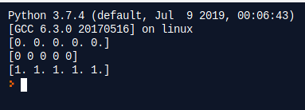


### zeros() ones()
```py
import numpy as np

matrix_2d = np.zeros((3,5))
print(matrix_2d)
matrix_3d = np.ones((3,6,5))
print(matrix_3d)
```

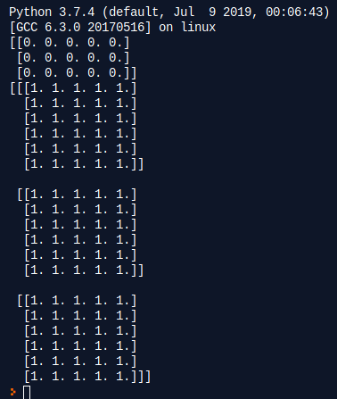


### Розмір і форма масивів
Ось деякі властивості, які можна дізнатися про масиви:

- Чи масив одно, двох, трьох і тд. вимірний
- Скільки елементів міститься у кожному вимірі (формі)
- Який тип масиву
- Яка загальна кількість елементів


### Розмір і форма масивів
```py
import numpy as np

arr = np.array([
  [3,2,1],[4,8,9],[9,4,5]
  ])

# ndim 1d, 2d, 3d or so...
print(arr.ndim)

# howe many items in each dementions
print(arr.shape)

# what data type
print(arr.dtype)

# total items
print(arr.size)
```


### reshape() flatten()
**reshape** надає нову форму масиву, не змінюючи його даних.

```py
numpy.reshape(a, newShape, order='C')
```

Аргументи:

- а - масив для зміни форми
- newShape - нова форма
- order - Порядок, у якому дані зберігаються у багатовимірному масиві, тобто у магістралі рядків ('F') або в основному стовпці ('C'). За замовчуванням - "C".


### reshape() flatten()
```py
import numpy as np

e  = np.array([(1,2,3), (4,5,6)])
print(e)

n = e.reshape(3,2)
print(n)
```

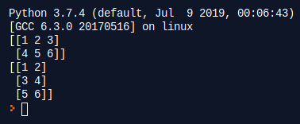


### reshape() flatten()
**flatten** повертає масив зжатий в один вимір. Часто застосовується для нейронних мереж.

```py
ndarray.flatten(order='C')
```


### reshape() flatten()
```py
import numpy as np

e  = np.array([(1,2,3), (4,5,6)])
print(e)

n = e.flatten()
print(n)
```

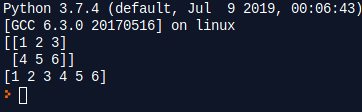


### hstack() vstack()
За допомогою hstack ви можете додавати дані по горизонталі. Це дуже зручна функція в Numpy.

```py
import numpy as np

f = np.array([[1,5,6],[3,8,9]])
g = np.array([[4,5,6], [9,4,7]])

print('Horizontal Append:', np.hstack((f, g)))
```

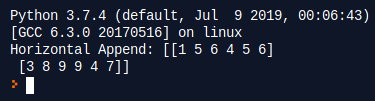


### hstack() vstack()
За допомогою **vstack** ви можете додавати дані вертикально.

```py
import numpy as np

f = np.array([[1,5,6],[3,8,9]])
g = np.array([[4,5,6], [9,4,7]])

print('Vertical Append:', np.vstack((f, g)))
```

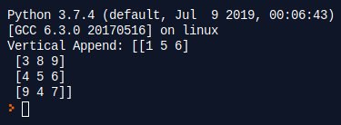


### Генерація рандомних чисел
Для генерації випадкових чисел в діапазоні можна використати функцію radint

```py
numpy.random.randint(low, high=None, size=None, dtype='l')
```

Аргументи:

- low - мінімально можливе згенероване число (дефол: мінімальне знакове int)
- hight - саксимально можливе згенероване число (дефолт: максимальне знакове int)
- size - Форма згенерованого масива. (m,n,k)
- stype - Тип int(int32, int64) і т.д.


### Генерація рандомних чисел
```py
import numpy as np

gen = np.random.randint(low=1, high=100, size=4)
print(gen)
```

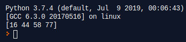


### Генерація рандомних чисел
Для генерації випадкових чисел для використання Гауссова розподілу:

```py
numpy.random.normal(loc, scale, size) 
```

Аргументи:

- loc: середня. Центр розповсюдження
- scale: стандартне відхилення.
- size: форма згенерованого масиву


### Генерація рандомних чисел
```py
import numpy as np

normal_array = np.random.normal(5, 0.5, 10)
print(normal_array)	
```

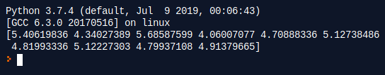


### Генерація рандомних чисел
Якщо побудувати графік, розподіл буде подібний до наступного

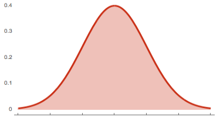


### arrange
Іноді потрібно створити значення, які рівномірно розташовані протягом визначеного інтервалу. Наприклад, ви хочете створити значення від 1 до 10; ви можете використовувати функцію numpy.arange ()

```py
numpy.arange(start, stop,step) 
```

Аргументи:

- start: початок інтервалу
- stop: кінець інтервалу
- step: крок між значеннями(дефолт: 1)


### arrange
```py
import numpy as np

print(np.arange(1, 11))	
```

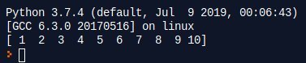


### Отримання елементів
Ви можете отримати конкретні елементи з масиву, використовуючи індексацію, починаючи з 0, щось подібне до того, як ви робите зі списками python.

Але на відміну від списків, numpy масиви необов'язково можуть приймати стільки параметрів у квадратних дужках, скільки є вимірів.


### Отримання елементів
```py
import numpy as np

arr1 = np.array([1,5,6])
arr2 = np.array([
  [2,5,6],
  [6,7,8]
])

print(arr1[0])
print(arr2[0, 0])
```


### Отримання елементів
Також в numpy можна використовувати slicing. Наприклад, [:,1]

У Python, як і в багатьох інших мовах:

- Значення перед комою використовуються для рядків
- Значення справа використовується для стовпців
- Якщо ви хочете вибрати стовпець, вам потрібно додати: перед індексом стовпця.
- : означає усі рядки з вибраного стовпця.


### Отримання елементів
```py
import numpy as np

arr = np.array([
  [1,7,6],
  [3,2,1],
  [5,7,8]
])

"""
: - all rows
, start working with columns
1 - second column
"""

print(arr[:,1])

"""
1 - second row
, start working with columns
:2 - first two values
"""

print(arr[1,:2])
```

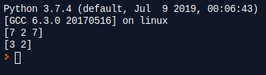


### Невизначенні значення і безкінечність
Відсутні значення можуть бути представлені за допомогою np.nan об'єкта, тоді як np.inf являє собою нескінченність.

```py
import numpy as np

arr2 = np.array([
  [2,5,6],
  [6,7,8]
], dtype='float')

arr2[0,0] = np.nan
arr2[0,1] = np.inf

print(arr2)

missing_bool = np.isnan(arr2) | np.isinf(arr2)
arr2[missing_bool] = -1  

print(arr2)
```


### Мінімальне, максимальне, середнє
```py
import numpy as np

arr = np.array([8,4,0,5,4])
# min
print(np.min(arr))
# max
print(np.max(arr))
# mean
print(np.mean(arr))
# median
print(np.median(arr))
# standart deviation
print(np.std(arr))
```

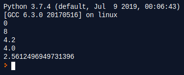

