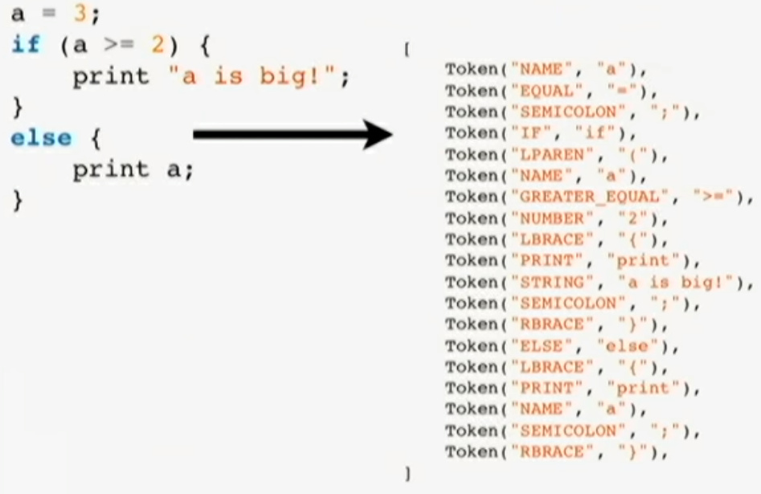
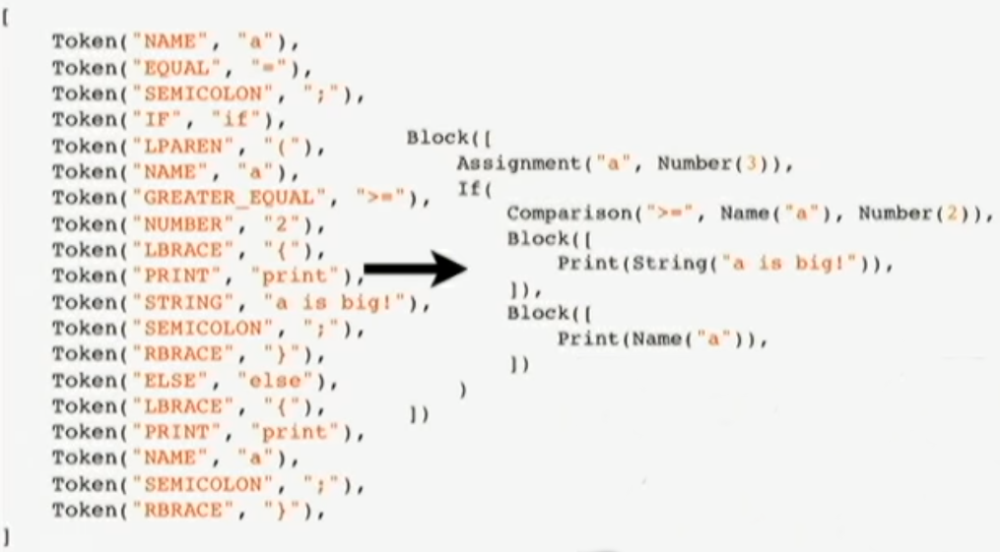

# Написати свою мову програмування


### Що таке інтерперетатор?

- Звичайна програма
- На вхід подається джерельний код
- На виході - результат виконання програми
- Ніякої магії


### Навіщо писати інтерперетатор?

- Хороший спосіб зрозуміти все працює
- Створення власної мови
- Створення специфічної, домено - орієтованої мови


### З чого складається інтереретатор?

- Lexer
- Parser
- AST
- Bytecode-compiler
- Bytecode interpreter
- Runtime

- Всі кроки послідовні (Source code -> Parser -> AST -> Bytecode-compiler -> Bytecode interpreter -> Runtime)


### Розроблювана мова?

```
a = 3;
if(a >= 2) {
    print "a is bigger than 2";
}
else {
    print a;
}
```


### rply

> Welcome to RPLY! A pure Python parser generator, that also works with RPython. It is a more-or-less direct port of David Beazley’s awesome PLY, with a new public API, and RPython support.

```bash
pip install rply
```


### Lexer?

В інформатиці лексичний аналіз ( «токенізація», від англ. Tokenizing) - процес аналітичного розбору вхідної послідовності символів на розпізнані групи - лексеми, з метою отримання на виході ідентифікованих послідовностей, званих «токенами»


### Lexer?




### Lexer?

```py
from rply import LexerGenerator

lg = LexerGenerator()
lg.ignore(r"\s+")
lg.add("IF", r"if")
lg.add("ELSE", r"else")
lg.add("PRINT", r"print")
lg.add("NUMBER", r"\d+")
.....
lg.add("NAME", r"[a-zA-z_][a-zA-Z0-9_]*")
lexer - lg.build()
```


### Lexer?

```
>>> stream = lexer.lex("my_var = 23")
>>> stream
<rply.lexer.LexerStream object>
>>> stream.next()
Token('NAME', 'my_var')
>>> stream.next()
Token('EQUAL', '=')
>>> stream.next()
Token('NUMBER', '23')
>>> stream.next()
>>>
```


### Parsers

**Синтаксичний аналіз** (або розбір, жарг. Парсинг ← англ. Parsing) в лінгвістиці та інформатики - процес зіставлення лінійної послідовності лексем (слів, токенів) природної або формальної мови з його формальною граматикою. Результатом зазвичай є дерево розбору (синтаксичне дерево).


### Parsers




### Parsers

```py
class Node:
    def __eq__(self, other):
        if not isinstance(other, Node):
            return NotImplemented
        return (type(self) is type(other) and
            self.__dict__ == other.__dict__)
    def __ne__(self, other):
        return not (self == other)
class Block(Node):
    def __init__(self, statements):
        self.statements = statements
class Statement(Node):
    def __init__(self, expr):
        self.expr = expr
class Number(Node):
    def __init__(self, value):
        self.value = value
```


### Parsers

```py
@pg.production("statements : statements statement")
def statements(s):
    return ast.Block(s[0].getastlist() + [s[1]])

@pg.production("statements : statement")
def statements(s):
    return ast.Block([s[0])

@pg.production("statement : expr SEMICOLON")
def statements(s):
    return ast.Statement([s[0])

@pg.production("expr : NUMBER")
def statements(s):
    return ast.NUMBER(float([s[0].getstr()))
```


### Parsers

```py
@pg.production("expr : expr PLUS expr")
def statements(s):
    return ast.BinOp(s[1].getstr(), s[0], s[2])
```


### Parsers


### Compiler

Bytecode:

- Перелік інструкцій для машини
- Інколи має аргументи
- Базується на стекові


### Compiler

```
1 + 21

LOAD_CONST 0
LOAD_CONST 1
BINARY_ADD
POP_TOP
```


### Compiler

```py
class Statement(Node):
    def compile(self, ctx):
    self.expr.compile(ctx)
    ctx.emit(POP_TOP)

class Number(Node):
    def compile(self, ctx):
    ctx.emit(LOAD_CONST, ctx.new_const(JSNumber(self.value)))
```


### Compiler

```py
class BinOp(Node):
    def compile(self, ctx):
    self.left.compile(ctx)
    self.right.compile(ctx)
    opname = {
        "+": "BINARY_ADD"
    }
    ctx.emit(opname[self.op])
```


### Object Model

```py
class JSObject(object):
    pass

class JSNumber(JSObject):
    def __init__(self, value):
        self.value = value
```


### Object Model

```py
class JSNumber(JSObject):
    def add(self, other):
        assert isinstance(other, JSNumber)
        return JSNumber(self.value + other.value)
```


### Interpreter

```py
class Interpreter:
    def interpret(self):
        pc = 0
        while pc < len(self.bytecode):
            opcode = self.bytecode[pc]
            opname = OPCODE_TO_NAME[opcode]
            pc = getattr(self, opname)(pc)
```


### Interpreter

```py
class Interpreter:
    def LOAD_CONST(self, pc):
        arg = ord(self.bytecode[pc + 1])
        self.push(self.consts[arg])
        return pc + 2
```


### Interpreter

```py
class Interpreter:
    def BINARY_ADD(self, pc):
        right = self.pop()
        left = self.pop()
        self.push(left.add(right))
        return pc + 1
```


### Example

- [py-examples](https://github.com/endlesskwazar/py-examples)
- rply-example


### LLVM

- Low Level Virtual Machine (LLVM) — універсальна система аналізу, трансформації і оптимізації програм, що реалізує віртуальну машину з RISC-подібними інструкціями. Може використовуватися як оптимізуючий компілятор цього байт-коду в машинний код для різних архітектур або для його інтерпретації та JIT-компіляції (для деяких платформ)
- LLVM дозволяє компілювати програми, написані на мовах С, C++, ObjC, Fortran, Ada, Haskell, Java, Python, Ruby, JavaScript, GLSL або будь-якій іншій, для якої реалізований front-end. В рамках проекту розроблено фронтенд Clang для мов C і C++ і версія GCC, що використовують LLVM як бекенд.
- У основі LLVM лежить проміжне представлення коду (intermediate representation, IR), над яким можна виконувати трансформації у всі компіляції, компонування і виконання. Із цього представлення генерується оптимізований машинний код для цілого ряду платформ, як статично, так і динамічно (JIT-компіляція).


### llvmlite

A lightweight LLVM python binding for writing JIT compilers

```bash
pip install llvmlite
```


### ir

```py
def fibonacci( n ):
  if n <= 1:
    return 1;
  return fibonacci( n - 1 ) + fibonacci( n - 2)
```


### ir

```py
from llvmlite import ir

# Створюємо 64 бітну інтову змінну
int_type = ir.IntType(64)
# Створюємо параметри функції
fn_int_to_int_type = ir.FunctionType( int_type, [int_type] )
# Створюємо модуль
module = ir.Module( name="m_fibonacci_example" )
# Створюємо функцію із ім'ям та заздалегіть визначиними параметрами у модулі
fn_fib = ir.Function( module, fn_int_to_int_type, name="fn_fib" )
# Створюємо блок(тіло функції)
fn_fib_block = fn_fib.append_basic_block( name="fn_fib_entry" )
# Білдер для того щоб почати реалізовувати функцію
builder = ir.IRBuilder( fn_fib_block )
# Отримуємо передані параметри функції
fn_fib_n, = fn_fib.args # , - tuple
# Дві константи
const_1 = ir.Constant(int_type,1)
const_2 = ir.Constant(int_type,2)
# Інструкція порівняння
fn_fib_n_lteq_1 = builder.icmp_signed(cmpop="<=", lhs=fn_fib_n, rhs=const_1 )
# Якщо інструкція порівняння true = ret const_1
with builder.if_then( fn_fib_n_lteq_1 ):
  builder.ret( const_1 )
fn_fib_n_minus_1 = builder.sub( fn_fib_n, const_1 )
fn_fib_n_minus_2 = builder.sub( fn_fib_n, const_2 )
# fibonacci( n - 1 )
call_fn_fib_n_minus_1 = builder.call( fn_fib, [fn_fib_n_minus_1] )
# fibonacci( n - 2 )
call_fn_fib_n_minus_2 = builder.call( fn_fib, [fn_fib_n_minus_2] )
fn_fib_rec_res =  builder.add( call_fn_fib_n_minus_1, call_fn_fib_n_minus_2 )
builder.ret( fn_fib_rec_res )
```


### ir
[docs](http://llvmlite.pydata.org/en/latest/index.html)


### Example

- [py-examples](https://github.com/endlesskwazar/py-examples)
- llvm-example

