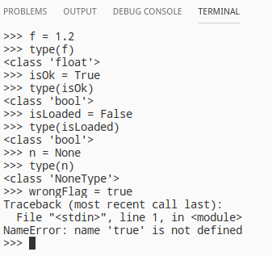
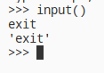
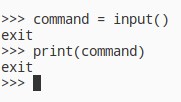
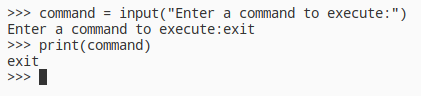

# Зміст

${toc}

# Історія і мотивація до вивчення

## Мотивація до вивчення

TIOBE індекс (рейтинг мов програмування) — показник популярності мов програмування. Розраховується виходячи з кількості результатів запитів до пошукових систем, що містять назву мови.


PYPL(PopularitY of Programming Language) index is created by analyzing how often language tutorials are searched.


Here are the most popular programming languages used at Github.


## Області застосування

Python - це дуже універсальна мова програмування, з плеядою користувачів у всіх можливих сферах від програмування мікроконтроллерів до розробки мобільних додатків, але сфери в яких python дійсно хорошо себе показує це:
- веб - розробка
- data science: машинне навчання, аналіз даних і візуалізація
- автоматизація процесів

## Історія

Історія мови програмування Python почалася в кінці 1980-х. Гвідо ван Россум задумав Python в 1980-х роках, а приступив до його створення в грудні 1989 року в центрі математики та інформатики в Нідерландах. Мова Python був задуманий як нащадок мови програмування ABC, здатний до обробки виключень і взаємодії з операційною системою Амеба. Ван Россум є основним автором Python і продовжував виконувати центральну роль в ухваленні рішень щодо розвитку мови аж до 12 липня 2018 року.

Версія Python 2.0 була випущена 16 жовтня 2000 року і містила багато нових великих функцій — таких як повний збирач сміття і підтримка Unicode. Однак найбільш важливим з усіх змін була зміна самого процесу розвитку мови і перехід на більш прозорий процес його створення.

Перша обернено-несумісна версія Python 3.0 була випущена 3 грудня 2008 року після тривалого періоду тестування. Багато її функції були перенести в обернено-сумісні Python 2.6 і Python 2.7.

Планувалося, що версії Python 2.x і Python 3.x будуть співіснувати паралельно протягом декількох релізів. Версія 2.x, головним чином, для сумісності з існуючими додатками, і з перенесенням в неї деяких можливостей 3.x. Python 2.6 був випущений як відповідний Python 3.0 і включав ряд його можливостей, а також режим «попередження», в якому підсвічувалася функціональність, віддалена в 3.x. Подібним же чином, Python 2.7 відповідав і включав функціональність Python 3.1, випущеного 26 червня 2009 року. Python 2.7 був останнім релізом 2.x: паралельні релізи припинилися на Python 3.2.

Таким чином зараз є дві поставки python 2.x(остання 2.7) і python 3.x(3.8 на момент написання).

# Як працює Python

Python - це мова програмування, яка виконується інтерпретатором. **Інтерпретатор** - це така програма, яка виконує інші програми. Коли ви пишете програму на мові Python, інтерпретатор читає вашу програму і виконує містяться в ній інструкції. Насправді, інтерпретатор — це шар програмної логіки між вашим програмним кодом і апаратурою вашого комп'ютера.

Але спочатку перед тим як інтерпретатор може виконувати код виконується компіляція в байт — код. Байт — код — це низькорівневе, платформно — незалежне уявлення вихідного тексту програми. Python транслює кожну інструкцію в вихідному коді сценарію в групи інструкцій байт-коду для підвищення швидкості виконання програми, бо байт-код виконується набагато швидше. Після компіляції в байт-код, створюється файл з розширенням ".pyc" по сусідству з вихідним текстом сценарію.

Наступного разу, коли ви запустите свою програму інтерпретатор мине етап компіляції і віддасть на виконання відкомпільований файл з розширенням ".pyc". Однак, якщо ви змінили вихідні тексти вашої програми, то знову відбудеться етап компіляції в байт-код, бо Python автоматично стежить за датою зміни файлу з вихідним кодом.

Якщо Python виявиться не в змозі записати файл з байт-кодом, наприклад через відсутність прав на запис на диск, то програма не постраждає, просто байт-код буде зібраний в пам'яті і при завершенні програми звідти вилучено.

Байт — код виглядає наступним чином:

```python
def hello()
    print("Hello, World!")
```

```
0 LOAD_GLOBAL              0 (print)
2 LOAD_CONST               1 ('Hello, World!')
4 CALL_FUNCTION            1
```

Після того як пройде процес компіляції, байт-код передається механізму під назвою віртуальна машина, яка і виконає інструкції з байт-коду. **Віртуальна машина** - це механізм часу виконання, вона завжди присутня в складі системи Python і це крайня складова системи під назвою "Інтерпретатор Python".


Програмісти, які мають досвід роботи з такими мовами як C і C ++, можуть помітити деякі відмінності в моделі виконання Python. Перше — це відсутність етапу складання або виклику утиліти "make", програми на Python можуть бути відразу ж запущені після написання вихідного коду. Друга відмінність — байт-код не є двійковим машинним кодом (наприклад інструкції для мікропроцесора Intel), він є внутрішнім поданням представленням на мові Python.

З цих причин програми на Python не можуть виконуватися також швидко як на C/C ++. Обхід інструкцій виконує віртуальна система, а не мікропроцесор, і щоб виконати байт-код, необхідна додаткова інтерпретація, інструкції якій вимагають більшого часу, ніж машинні інструкції мікропроцесора.

# Особливості синтаксису

Особливості синтаксису python полягають в тому, що на відміну від таких мов як C/C++, Java, JavaScript, Java контекст коду визначається не фігурними дужками, а рівнями відступу.

Наприклад:

c++:
```cpp
if (a == 3) {
//if scope
}
```

python
```python
if a == 3:
  //ident if scope
```

> Ще однією особливістю є те, що нам не потрібно ставити крапку з комою(;) в кінці виразу.

# Установка і запуск

Завантажте файл інсталяції із [python.org](https://www.python.org/downloads/).

Відкрийте інсталятор і не забудьте поставити галочку "Add Python to PATH"


Перевірити правильність установки можна, виконавши команду python в терміналі(відкриває інтерактивний shell в терміналі).

Для того, щоб виконати python - файл(розширення .py) потрібно передати його назву як параметр в команду python:

```bash
python main.py
```

# Типи даних

Якщо досить формально підходити до питання про типізацію мови Python, то можна сказати, що він відноситься до мов з неявною сильною динамічною типізацією.

Неявна типізація означає, що при оголошенні змінної вам не потрібно вказувати її тип, при явній — це робити необхідно. Як приклад мов з явною типізацією можна привести Java, C++. Ось як буде виглядати оголошення цілочисельний змінної в Java і Python.

java:
```java
int a = 1;
```

python:
```python
a = 1
```

Сильна типізація не дозволяє проводити операції у виразах з даними різних типів, слабка - дозволяє. У мовах з сильною типізацією ви не можете складати наприклад рядки і числа, потрібно все приводити до одного типу. До першої групи можна віднести Python, Java, до другої — С/С++, javascript.

В python існують наступні вбудовані типи даних(Жирним виділені, ті які ми зараз розглянемо. Інші типи — в наступних лекціях):
1. **None**
2. **Логічні (Boolean)**
3. Числа
    1. **int**
    2. **float**
    3. complex
4. Списки
    1. **list**
    2. tuple
    3. range
5. **Строка str**
6. Бінарні списки
    1. bytes
    2. bytearray
    3. memoryview
7. Множини
    1. set
    2. frozenset
8. Словник(dict)

## Модель даних

Створимо і ініціалізуємо нову змінну:

```py
b = 5
```

Цілочисельне значення 5 в рамках мови Python по суті своїй є об'єктом. Об'єкт, в даному випадку — це абстракція для представлення даних, дані — це числа, списки, рядки і т.п.

Кожен об'єкт має три атрибути — це ідентифікатор, значення і тип. Ідентифікатор — це унікальна ознака об'єкта, що дозволяє відрізняти об'єкти один від одного, а значення — безпосередньо інформація, що зберігається в пам'яті, якою управляє інтерпретатор.

При ініціалізації змінної, на рівні інтерпретатора, відбувається наступне:
- створюється цілочисельний об'єкт 5 (можна уявити, що в цей момент створюється комірка і 5 кладеться в цю комірку);
- даний об'єкт має певний ідентифікатор, значення: 5, і тип: ціле число;
- за допомогою оператора "=" створюється посилання між змінної b і цілочисельним об'єктом 5 (змінна b посилається на об'єкт 5).

Для того, щоб подивитися на об'єкт з яким ідентифікатором посилається дана змінна, можна використовувати функцію id ():

```python
b = 5
id(5)
```


Розгляньмо інший приклад:
```py
>>> a = 4
>>> b = 5
>>> id(a)
1829984576
>>> id(b)
1829984592
>>> a = b
>>> id(a)
1829984592
```

Як видно з прикладу, спочатку змінна a посилається на об'єкт 4 з ідентифікатором 1829984576, змінна b - на об'єкт з id = 1829984592. Після виконання операції присвоювання a = b, змінна a стала посилатися на той самий об'єкт, що і b.


Тип змінної можна визначити за допомогою функції type (). Приклад використання наведено нижче:


В Python існують змінювані і незмінні типи.

До незмінних (immutable) типам відносяться: цілі числа (int), числа з плаваючою точкою (float), комплексні числа (complex), логічні змінні (bool), кортежі (tuple), рядки (str) і незмінні множити (frozen set).

До змінних (mutable) типам відносяться: списки (list), множини (set), словники (dict).

Як оголосити змінну типу int ми розглянули, тепер розглянемо інші числові типи та логічні змінні:



# Списки

Списки в Python - впорядковані змінювані колекції об'єктів довільних типів (майже як масив, але типи можуть відрізнятися).

Щоб використовувати списки, їх потрібно створити. Створити список можна декількома способами. Наприклад, можна обробити будь-який перечислюваний тип об'єкт (наприклад, рядок):

```py
list('список')
```

Список можна створити та за допомогою літерала:

```py
s = []
l = ['s', 'p', ['isok'], 2]
```

І ще один спосіб створити список — це генератори списків. Генератор списків — спосіб побудувати новий список, застосовуючи вираз до кожного елементу послідовності. Генератори списків дуже схожі на цикл for.

```py
c = [c * 3 for c in 'list']
c = [c * 3 for c in 'list' if c != 'i']
```

Деякі функції, які можна використати на списках:
|Метод|Пояснення|
|-|-|
|list.append(x)|Додає елемент в кінець списку|
|list.extend(L)|Розширює список list, додаючи в кінець всі елементи списку L|
|list.insert(i, x)|Вставляє на i-ий елемент значення x|
|list.remove(x)|Видаляє перший елемент у списку, який має значення x. ValueError, якщо такого елемента не існує|
|list.pop([i])|Видаляє i-ий елемент і повертає його. Якщо індекс не вказано, видаляється останній елемент|
|list.index(x, [start [, end]])|Повертає положення першого елемента зі значенням x (при цьому пошук ведеться від start до end)|
|list.count(x)|Повертає кількість елементів зі значенням x|
|list.reverse()|перевертає список|

# str

Строки в python можна оголосити використовуючи одинарні або подвійні кавички. Між цими двома способами немає ніякої різниці, за виключенням ескейпа, якщо одинарна або подвійна кавичка є частиною строки.

```py
str1='Hello "Python"'
str2="Hello 'Python'"
```

Базові операції та методи:

- Конкатенація (додавання)

```py
S1 = 'spam'
S2 = 'eggs'
print(S1 + S2)
```

- дублювання рядка

```py
print('spam' * 3)
```

- довжина рядка

```py
len('spam')
```

- доступ по індексу

```py
S = 'spam'
S[0]
S[2]
S[-2]
```

# Умовні оператори

Умовна інструкція if-elif-else (її ще іноді називають оператором розгалуження) - основний інструмент вибору в Python. Простіше кажучи, вона вибирає, яку дію слід виконати, в залежності від значення змінних в момент перевірки умови.

Загальна форма запису умовної інструкції if виглядає наступним чином:

```py
if test1:
    state1
elif test2:
    state2
else:
    state3
```

або:

```py
if a:
  print("a");
else:
  if b:
    print("b")
  else:
    print("None")
```

## Перевірка на True

- Будь-яке число, не рівне 0, або непорожній об'єкт — істина.
- Числа, рівні 0, порожні об'єкти і значення None - брехня

## Логічні оператори

```py
X and Y
```

Істина, якщо обидва значення X і Y істинні.

```py
X or Y
```

Істина, якщо хоча б одне зі значень X або Y істинно.

```py
not X
```

Істина, якщо X брехня.

## Тернарний оператор

Наступна інструкція:
```py
if X:
    A = Y
else:
    A = Z
```

Досить коротка, але, займає цілих 4 рядки. Спеціально для таких випадків і був придуманий тернарний оператор:

```py
A = Y if X else Z
```

# Цикли

## while

While - один з найбільш універсальних циклів в Python, тому досить повільний. Виконує тіло циклу до тих пір, поки умова циклу істинно.

```py
i = 5
while i < 15:
    print(i)
    i = i + 2
```

## for

Цикл for вже трішки складніше, трохи менше універсальний, але виконується набагато швидше циклу while. Цей цикл проходиться по будь-якому перелічуваному об'єкту (наприклад рядку або списку), і під час кожного проходу виконує тіло циклу.

```py
for i in 'hello world':
    print(i * 2, end='')

for i in [1,2,3]:
    print(i)
```

Цикл for із лічильником:

```py
count=0
for item in list:
    print item
    count +=1
    if count % 10 == 0:
        print 'did ten'
```

```py
for count in range(0,len(list)):
    print list[count]
    if count % 10 == 0:
        print 'did ten'
```

```py
#count=0
for idx, item in enumerate(list):
    print item
    #count +=1
    #if count % 10 == 0:
    if (idx+1) % 10 == 0:
        print 'did ten'
```

## break, continue

Оператор **continue** починає наступний прохід циклу, минаючи тіло циклу, яке залишилося (for або while):

```py
for i in 'hello world':
    if i == 'o':
        continue
    print(i * 2, end='')
```

Оператор **break** достроково перериває цикл:

```py
for i in 'hello world':
    if i == 'o':
        break
    print(i * 2, end='')
```

## do..while

Цикл do while відрізняється від циклу while тим, що в do while спочатку виконується тіло циклу, а потім перевіряється умова продовження циклу. Через таку особливість do while називають циклом з умовою поста. Таким чином, якщо умова do while свідомо неправдиве, то хоча б один раз блок операторів в тілі циклу do while виконається.

І такої конструкції - do ... while немає в Python. Але його можна реалізувати власноруч:

```py
while True:
  stuff()
  if fail_condition:
    break
```

## else

Слово else, застосоване в циклі for або while, перевіряє, чи був проведений вихід з циклу інструкцією break, або ж "природним" чином. Блок інструкцій всередині else виконається тільки в тому випадку, якщо вихід з циклу стався без допомоги break.

```py
for i in 'hello world':
    if i == 'a':
        break
else:
print('Букву а не знайдено')
```

# Особливості print, input

Функція **print()** виводить задані об'єкти на стандартний пристрій виводу (екран) або відправляє їх текстовим потоком у файл.

Повний синтаксис функції print ():
'''py
print(*objects, sep=' ', end='n', file=sys.stdout, flush=False)
'''

Де:
- objects - об'єкт, який потрібно вивести * позначає, що об'єктів може бути кілька;
- sep - розділяє об'єкти. Значення за замовчуванням: ' ';
- end - ставиться після всіх об'єктів;
- file - очікується об'єкт з методом write (string). Якщо значення не задано, для виведення об'єктів використовується файл sys.stdout;
- flush - якщо задано значення True, потік примусово скидається в файл. Значення за замовчуванням: False.

> Примітка: sep, end, file і flush - це аргументи-ключові слова. Якщо хочете скористатися аргументом sep, використовуйте:

```py
print(*objects, sep = 'separator')
```

Приклад виведення одного об'єкта:

```py
print('text')
```

Приклад виведення декількох об'єктів:

```py
print('text1', 'text2', 'text3')
```

Приклад виведення декількох об'єктів, використовуючи tab в якості роздільника:

```py
print("text1", "text2", "text3", sep = '\t')
```

Приклад виведення декількох об'єктів, використовуючи tab в якості роздільника і крапки в якості останього символу:

```py
print("text1", "text2", "text3", sep = '\t', end = '.')
```

Приклад запису у файл:

```py
sourceFile = open('python.txt', 'w')
print("Some file Content", file = sourceFile)
sourceFile.close()
```

Код, наведений вище, намагається відкрити файл python.txt в режимі запису. Якщо файл не існує, програма створює файл python.txt і відкриває його в режимі запису. Другий параметр функції open() може бути наступним:

|Режим|Значення|
|-|-|
|r|відкриття на читання (є значенням за замовчуванням).|
|w|відкриття на запис, вміст файлу видаляється, якщо файлу не існує, створюється новий.|
|x|відкриття на запис, якщо файлу не існує, інакше виняток.|
|a|відкриття на дозапис, інформація додається в кінець файлу.|
|b|відкриття в бінарному режимі.|
|t|відкриття в текстовому режимі (є значенням за замовчуванням).|
|+|відкриття на читання і запис|

Насправді функція open() повертає самостійний об'єкт файлу, який може бути використаний для запису без використання print():

```py
sourceFile = open('python.txt', 'w')
f.write('another content of file')
```

Щоб зчитати дані із файла потрібно використати метод read:

```py
sourceFile = open('python.txt')
text = sourceFile.read()
print(text)
```

В функцію read можна передати числовий параметр, який вказує скільки символів ми хочемо прочитати:

```py
sourceFile = open('python.txt')
text = sourceFile.read(2)
print(text)
```

Зверніть увагу, що в такому випадку посилання на даний індекс початку буде зміщено, тому якщо ми ще раз схочемо використати read() із параметром будуть прочитані наступні символи:

```py
sourceFile = open('python.txt')
text = sourceFile.read(2)
other = sourceFile.read(2)
print(other)
```

Є ще один спосіб читання із файла, а саме із використанням циклу for:
```py
sourceFile = open('python.txt')
for line in sourceFile:
        print(line)
```

Функція **input()**:

Ми вже зустрічалися з функцією print (). Вона відповідає за виведення даних, за замовчуванням на екран. 

За введення в програму даних з клавіатури в Python відповідає функція input(). Коли викликається ця функція, програма зупиняє своє виконання і чекає, коли користувач введе текст. Після цього, коли він натисне Enter, функція input() забере введений текст і передасть його програмі, яка вже буде обробляти його відповідно до своїх алгоритмам.

Якщо в інтерактивному режимі ввести команду input (), то нічого цікавого ви не побачите. Комп'ютер буде чекати, коли ви введете щось і натиснете Enter або просто натиснете Enter. Якщо ви щось ввели, це відразу ж відобразитися на екрані:



Функція input () передає введені дані в програму. Їх можна привласнити змінної. В цьому випадку інтерпретатор не виводить рядок відразу ж. За бажанням, ми можемо вивести її самостійно:



Вищенаведений скрипт далекий від досконалості. Звідки користувачеві знати, що хоче від нього програма? Щоб не вводити в замішання для функції input () передбачений спеціальний параметр-запрошення. Це запрошення виводиться на екран при виклику input ().



Зверніть увагу, що в програму надходить рядок. Навіть якщо ввести число, функція input () все одно поверне його строкове представлення. Але що робити, якщо треба отримати число? Відповідь: використовувати функції перетворення типів.


# Домашнє завдання

1. Запросіть у користувача число, перевірте чи воно ділиться на два, якщо так допишіть його у файл(перезаписувати неможна).
2. Запросіть у користувача 3 рази ввести текст, запишіть цей текст у файл. Прочитайте і виведіть зміст файлу по-рядку.
3. Зчитайте текстовий документ, запропонуйте користувачеві ввести слово, спробуйте знайти це слово в зчитаному файлі і виведіть повідомлення про результат.
4. Запропонуйте користувачеві ввести три числа. Запишіть найбільше число в текстовий документ.
5. Запропонуйте користувачеві ввести шлях до файлу. Спробуйте відкрити цей файл і вивести його вміст користувачеві. Запропонуйте користувачеві ввести текст. Допишіть введений текст, до вказаного користувачеві файлу.
6. Запропонуйте користувачеві ввести два числа і математичний оператор(-,+,/,*), проведіть відповідну математичну операцію і виведіть результат.
7. Створіть текстовий документ, який містить 10 чисел, які розділені переводом строки. Зчитайте файл і додайте всі числа.
8. Створіть список із п'яти числових елементів. Запишіть цей список у файл(розділяючи елементи). Завантажте файл і переведіть вміст у список.
9. Запропонуйте користувачеві ввести текст. Виділіть всі пробіли та крапки із тексту і запишіть у файл.

# Контрольні запитання

1. Як працює Python?
2. Поясніть модель даних Python.
3. Як в Python оголосити змінну і дізнатися її тип?
4. Перелічіть цикли і їх синтаксис в Python.
5. Для цього в циклах використовуються break, continue, else?
6. Поясніть функцію print.
7. Як за допомогою функції open() можна зчитати і записати в файл?
8. Поясніть функцію input().