# Зміст

${toc}

# Функції

Функція в python - об'єкт, який приймає аргументи і повертає значення. Зазвичай функція визначається за допомогою інструкції def.

```py
def [identifier](param1,param2,....paramN):
    [func body]
```

Наприклад:

```py
def sum(a, b):
    return a + b
```

**Якщо, Ви стикалися іщ функціями в такій мові прогрмування як C/C++, яка є статисно типізованою ось деякі ключові моменти, які потрібно знати:**

- **Типи параметрів функції**

Оскільки python динамічно - типізована мова програмування і нам не потрібно вказувати тип параметра, туди передати ми можемо будь-що: Напиклад функція, яка, начебто повинна додавати 2 числа, немподівано може опинитися функцією конкатенації:

```py
def add_two_numbers(a, b):
  return a + b

print(add_two_numbers(5,8))
print(add_two_numbers("Hello", " World!!!"))
```

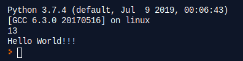

Або і взагалі виконатися із помилкою:

```py
def add_two_numbers(a, b):
  return a + b

print(add_two_numbers(5, "Word"))
```

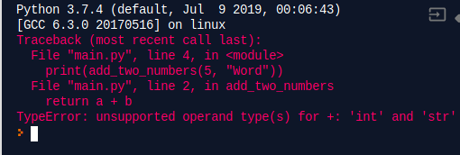

В даному випадку додати число із строкою не можна, оскільки в еас відсутній статичний етп компіляції, то підсказок не буде ніяких про помилку.

Боротися із такими ситуаціями можна, наприклад, використавши функцію isinstance(яка перевірить чи переданий в неї об'єкт є екземпляром вказаного типу) і умовний оператор:

```py
def add_two_numbers(a, b):
  if not isinstance(a, int):
    print("a must be int")
    return
  if not isinstance(b , int):
    print("b must be int")
    return
  return a + b

print(add_two_numbers(5, "Word"))
```

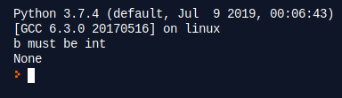

- **Результат виконання функції**

Оператор return, який зустрічається в тілі функції завершує її виконання, якщо поряд з оператором return буде об'єкт, його буде повернуто, в іншому випадку буде повернуто None. Давайте це продумонмтруємо:

```py
def some_func(a):
  if a < 5:
    return 5
  elif 10 < a > 5:
    return

res1 = some_func(1)
res2 = some_func(8)
res3 = some_func(22)
print("res1", res1)
print("res2", res2)
print("res3", res3)
```

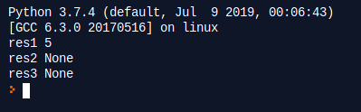

## immutable і mutable параметри

Дуже важливо спочатку зрозуміти змінні та незмінні об'єкти. У Python є два типи об'єктів: змінні та незмінні.

- Для незмінних об'єктів зміна їх усередині функції створить новий екземпляр, а оригінальні екземпляри поза функцією не зміняться. Незмінними об'єктами в Python є рядок, числа та кортеж.
- Для об'єктів, що змінюються, будь-які зміни, внесені до об'єктів всередині функції, впливатимуть на екземпляр поза функцією. Але перепризначення екземпляра не вплине на екземпляр поза функцією. Об'єкти, що змінюються в Python, включають список, словник, екземпляр класу.

Розгляньмо приклад:
```py
def change(a, b, c, d):
  a = 3
  b = "qwe"
  c = [1,2,3]
  d.append(77)

a = 1
b = "zxc"
c = [4,5,6]
d = [44]

change(a, b, c, d)

print("a", a)
print("b", b)
print("c", c)
print("d", d)
```

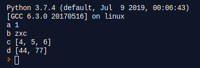

## Параметри за замовчуванням та іменовані параметри

Для всіх параметрів функцій можна вказувати значення за замовчуванням, це дає можливість випустити функцію з меншим числом параметрів. Наприклад, у нас є функція для авторизації користувача на сайті:

```py
def login(username="anonymous", password=None):
    pass
```

Викликати цю функцію можна декількома способами:

```py
login("root", "ujdyzysqgfhjkm")
login("guest")
login()
```

Але звирніть увагу, що наприклад такий код, призведе до помилки:

```py
def some(a = 3, b):
  pass
```

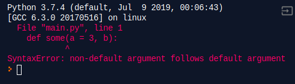

Не дефолтний параметр не може слідувати після дефолтного.

Ми може передавати в функцію параметри не попорядку використовуючи іменовані параметри, наприклад:

```py
def login(username="anonymous", password=None):
    pass

login(password="nobody@mail.com") 
```

## Rest - параметр

Задача: написати функцію, яка приймає будь-яку кількість рядків конкатенує і поверає їх. Вирішити таку задачку допоможе rest - параметр: якщо поставити * перед іменем параметра - це означає взяти всі передані і зробити список всіх переданих параметрів.

```py
def concat(*strs):
  res = ''
  for str in strs:
    res += str
  return res

print(concat('Hello', ' World'))
print(concat('Hello ', 'World', '!!!'))
```

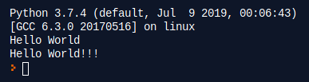


# Функції "as first class citizens"

Виконаймо наступний код:

```py
a = 3
b = 'Hello World!!!'

def some_func():
  pass

print(type(a))
print(type(b))
print(type(some_func))
```

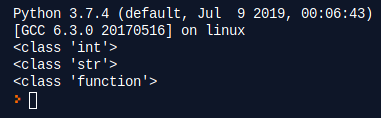

В Python вбудовані типи - це об'єкти, навіть функції - це об'єкти. Такий механізм називається "functions as first class citizens", а це значить:

- Можна зробити посилання на функцію

```py
def print_text(text):
  print(text)

a = print_text
b = print_text

print_text("Original")
print_text("Link a")
print_text("Link b")

print(id(print_text))
print(id(a))
print(id(b))
```

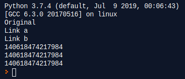

- Функцію можна передати як параметр

```py
def higher_order_function(value, cb):
  if value > 5:
    cb("More then five")
    return
  return cb("Less then five")

def print_text(text):
  print(text)

higher_order_function(1, print_text)
a = print_text
higher_order_function(10, a)
```

# Документація функцій

## Doc - string

Doc trings - рядкові летурали, які є першим оператором в модулі, функції, класі або визначенні методу. Такий рядковий літерал стає атрибутом __doc__ цього об'єкта.

Усі модулі мають, як правило, повинні містит doc strings, і всі функції та класи.

Для узгодження, завжди використовуйте "" потрійні подвійні цитати "" "для строкової документації.

Наприклад:

```py
def concat(a, b):
  """ Return concat of two strings """
  return a + b

print(concat.__doc__)
```

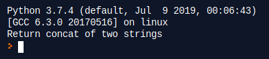

Якщо документація не поміщається в один рядок можна використати багаторядковий doc - string:

```py
def concat(a, b):
  """ Return concat of two strings
    
      a: str
      b: str

  """
  return a + b
```

Повна документація функції включає в себе:
- Пояснення функції
- Перелік параметрів і їх типів
- Можливі виключення, які кидає функція
- Тип і пояснення значення, яке функція повертає

```py
def transfer_medicine_to_storage(medicine, to_storage, amount, invoice_number, insurance_company):
    """
    Transfer medicine from one storage to another by passed amount

    :param (int|Storage) to_storage: storage to transfer
    :param (str) invoice_number: invoice number
    :param (Medicine) medicine: Medicine to transfer
    :param (Decimal) amount: Amount to transfer
    :param (int|InsuranceCompany) insurance_company: Insurance company
    :raises MedicineAmountError: If medicine amount less then requested amount
    :return (int): Transferred medicine id
    """
```

# Перевірка типів параметрів

Хоча Python динамічно - типізована мова програмування, ми можемо підказати тип змінної наприклад(Python 3):

```py
a: int = 1
b: int = 'text'

print(a)
print(b)
```

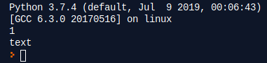

**Зверніть увагу**, що ніякої помилки в тому, що ми вказали int а присвоїли str. Python runtime не застосовує примітки до функцій та змінних типів. Вони можуть використовуватися сторонніми інструментами, такими як type checker, IDE, linters тощо.

Також ми можемо підказувати типи даних для функції:

```py
def concat(a: str, b: str) -> str:
  return a + b
```

Тоді наприклад IDE може дати наступну підказку:

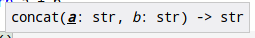


# Модульність

Модулем в Python називається будь-який файл python - файл. Кожна програма може імпортувати модуль і отримати доступ до його класів, функцій і об'єктів.

У Python є ключові слова для імпорту модулів. Спробуйте ось цей:

```py
import this
```

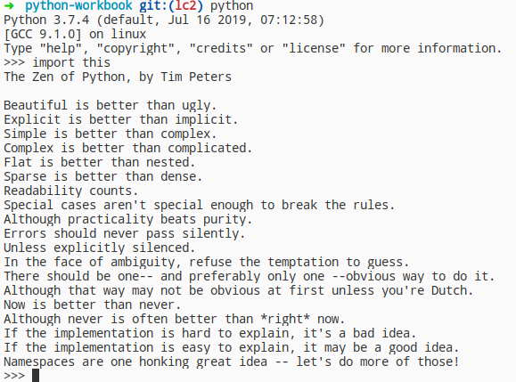

Вітаємо, ви знайшли «пасхальне яйце» в Python, також відоме як «Дзен». Це одна з кращих неофіційних частин роботи в Python. Сам по собі модуль this не робить нічого особливого, тільки показує оригінальний спосіб імпорту чогось. Тепер давайте імпортуємо що-небудь, чим ми зможемо скористатися в майбутньому, наприклад, модуль math:

```py
import math
 
print(math.sqrt(4)) # 2.0
```

Ми імпортували модуль math і використали функцію sqrt, - це не єдина функція в цьому модулі і нам доступні вони всі використовуючи лише ``` import math ```

Ви можете імпортувати з модуля тільки ті функції, які вам потрібні. Уявімо, що нам потрібно імпортувати тільки функцію sqrt:

```py
from math import sqrt
 
print( sqrt(16) ) # 4.0
```

Таким чином нам буде доступна лише функція sqrt із модуля math. Але, уявімо наступну ситуацію:

```py
from math import sqrt

def sqrt(x):
  pass

print(sqrt(9))
```

Як результат ми отримаємо попередження "redefinition of unused 'sqrt'" і неможливість використання імпортованої функції із модуля math. В Python і для такої ситуації є рішення, використовуючи alias(ключове слово as):

```py
from math import sqrt as sq

def sqrt(x):
  pass

print(sq(9)) # 3.0
```

Покищо ми імпортували лише вбудовані модулі в Python. Давайте напишемо власні. Нехай в нас буде така структура проекту:

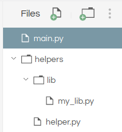

Із наступним всістом файлів:

helpers/helper.py:
```py
MAGICNUMBER = 44

def helper_func(a):
  print('i`m a helper function')
```

helpers/lib/my_lib.db:
```py
def db_connect(con):
  is_connected = True
  return is_connected
```

Імпортувати ці модулі в main.py можна наступним чином:

```py
from helpers.helper import MAGICNUMBER
from helpers.helper import helper_func
from helpers.lib.my_lib import db_connect

print(MAGICNUMBER)
helper_func(3)
print(db_connect(1))
```

??? here is explanation of path

???????????????? here is example of import all with like default syntax modules

# Модуль datetime

Модуль datetime містить наступні класи:
- datetime.date
- datetime.time
- datetime.datetime
- datetime.timedelta

## datetime.date

Конструктор класа:
```py
datetime.date(year, month, day)
```

Ініціалізація об'єкта:
```py
import datetime

some_date = datetime.date(2019, 9, 1)
print(some_date)
```

Об'єкт datetime.date є три поля (year, day, month) які ми можемо прочитати і змінити:
```py
import datetime

some_date = datetime.date(2019, 9, 1)
print("Year: ", some_date.year) # 2019
print("Month: ", some_date.month) # 9
print("Day: ", some_date.day) # 1
```

**Зверніть увагу**. Поля year, day, month не можна модифікувати - це призведе до помилки.

```py
import datetime

some_date = datetime.date(2019, 9, 1)
some_date.year = 2018
```

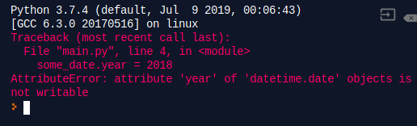

???? heres info about comparing date

???? heres info about internal max/min dates

## datetime.time

Часовий об'єкт, datetime.time, представляє місцевий час.

Є декілька варіантів створення об'єкта time:

Пустий конструктор:
```py
from datetime import time

some_time = time()
print(some_time)
```

hour, minutes, seconds:
```py
from datetime import time

some_time = time(12, 30, 55)
print(some_time) # 12:30:55
```

hour, minute, second, microsecond:
```py
from datetime import time

some_time = time(12, 30, 55, 234566)
print(some_time) # 12:30:55.234566
```

Після створення об’єкта time ви можете легко надрукувати його атрибути, такі як година, хвилина тощо:

```py
from datetime import time

some_time = time(12, 30, 55, 234566)
print("Hour: ", some_time.hour)
print("Minutes: ", some_time.minute)
print("Second: ", some_time.second)
print("Microsecond: ", some_time.microsecond)
```

## datetime.datetime

Об'єкт datetime.datetime містить всю інформацію об'єктів datetime.date плюс datetime.time. Розгляньмо декілька прикладів, для кращого розуміння.

```py
import datetime
 
a = datetime.datetime(2017, 3, 5)
print(a) # datetime.datetime(2017, 3, 5, 0, 0)
 
b = datetime.datetime(2017, 3, 5, 12, 30, 10)
print(b) # datetime.datetime(2017, 3, 5, 12, 30, 10)
 
d = datetime.datetime(2017, 3, 5, 12, 30, 10)
print(d.year) # 2017
print(d.second) # 10
print(d.hour) # 12
```

## datetime.timdelta

## now

Часто трапляються ситуації, коли потрібно сьогоднішню дату і час, який є зараз. Розгляньмо як це можна зробити. використовуючи модуль datetime.

### Current date and time

```py
import datetime

datetime_object = datetime.datetime.now()
print(datetime_object)
```

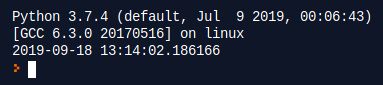

### Current date

```py
import datetime

date_object = datetime.date.today()
print(date_object)
```

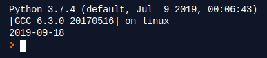

# Домашнє завдання

# Варіанти

1.
2.
3.
4.
5.
6.
7.
8.
9.
10.

# Контрольні запитання

1. віапвіа
2. ів аів
3. іваіва
4. іваіва
5. іваі
6. іваів
7. іваів
8. іваіва