# Зміст

${toc}

# ООП. Загальні терміни

## Intro

**Клас** - це фундаментальний будівельний блок в Python. Він лежить в основі не тільки багатьох популярних програм і бібліотек, але і стандартної бібліотеки Python. Розуміння, що таке класи, коли їх використовувати та як вони можуть бути корисними, є важливим навичком і нашою поточною метою. У цьому процесі ми вивчимо, що означає термін «Об’єктно-орієнтоване програмування» та як він пов’язаний разом із класами Python.

## Ключове слово class

Для чого саме використовується ключове слово **class**? Як і його двоюрідний брат, заснований на функціях, він стосується оголошення. У той час як def використовується для визначення функції, class використовується для визначення класу. А що таке клас? Просто логічне групування даних та функцій (останні з них часто називають "методами", коли вони визначені в класі).

Що мається на увазі під логічним групуванням? Ну, клас може містити будь-які дані, які ми хотіли б, і може до нього додавати будь-які функції (методи), які нам подобаються. Замість того, щоб просто з'єднувати випадкові речі разом під назвою "class", ми намагаємось створити класи, де існує логічний зв'язок між речами.

Інколи класи базуються на об'єктах у реальному світі (наприклад, Customer чи Student). В інших випадках класи базуються на таких поняттях у нашій системі, як HTTPRequest або EventLoop.

Незалежно від того, що класи - це техніка моделювання; спосіб мислення про програми. Коли ви думаєте та реалізуєте свою систему таким чином, ви виконуєте об'єктно-орієнтоване програмування. "Класи" та "об'єкти" - це слова, які часто вживаються взаємозамінно, але вони насправді не одне і те саме. Розуміння того, що робить їх різними - це ключ до розуміння того, що вони є, і як вони працюють.

## Оголошення класу

Клас можна розглядати як креслення для створення об’єктів. Коли визначено клас Customer за допомогою ключового слова, фактично самого клієнта не було створено. Натомість - це свого роду інструкція з побудови об’єктів "Customer". Давайте розглянемо наступний приклад коду:

```py
class Customer(object):
    """A customer of ABC Bank with a checking account. Customers have the
    following properties:

    Attributes:
        name: A string representing the customer's name.
        balance: A float tracking the current balance of the customer's account.
    """

    def __init__(self, name, balance=0.0):
        """Return a Customer object whose name is *name* and starting
        balance is *balance*."""
        self.name = name
        self.balance = balance

    def withdraw(self, amount):
        """Return the balance remaining after withdrawing *amount*
        dollars."""
        if amount > self.balance:
            raise RuntimeError('Amount greater than available balance.')
        self.balance -= amount
        return self.balance

    def deposit(self, amount):
        """Return the balance remaining after depositing *amount*
        dollars."""
        self.balance += amount
        return self.balance
```

Клас Customer(object) не створює нового клієнта. Тобто, лише тому, що ми визначили Customer, це не означає, що ми його створили; ми просто зробили креслення для створення об’єкта «Customer». Для цього ми викликаємо метод __init__ класу з належною кількістю аргументів.

Отже, щоб використати "креслення", яке ми створили, визначивши клас Customer, ми викликаємо ім'я класу майже так, як якщо б це було функцією: jeff = Customer('Jeff Knupp', 1000.0). Цей рядок просто говорить "використовувати креслення Customer, створи мені новий об'єкт, який я буду називати jeff".

Ми, звісно, можемо створити стільки об'єктів Customer, скільки б нам хотілося. Однак існує лише один клас клієнта, незалежно від кількості створених нами примірників класу.

## Атрибути

В прикладі із Customer withdraw і deposit - це атрибути. Атрибути класу бувають двох видів:

- атрибути - дані
- атрибути методи

Атрибути даних зазвичай записуються зверху. Пам'ять для атрибутів виділяється в момент їх першого присвоювання - або зовні, або всередині методу. Методи починаються зі службового слова def.

Доступ до атрибутів виконується за схемою obj.attrname

```py
class Student:

  # атрибут - дані
  name = 'Alex'

  # атрибут - метод
  def printName(self):
    print(self.name)


s = Student()
s.printName()
```

## self

Зазвичай перший аргумент в імені методу - self. Як каже автор мови Гвідо Ван Россум, це не більше ніж традиція: назва self не має абсолютно ніякого спеціального значення.

self корисний для того, щоб звертатися до інших атрибутів класу.

self - це аналог "this" в С++, C#, JAVA

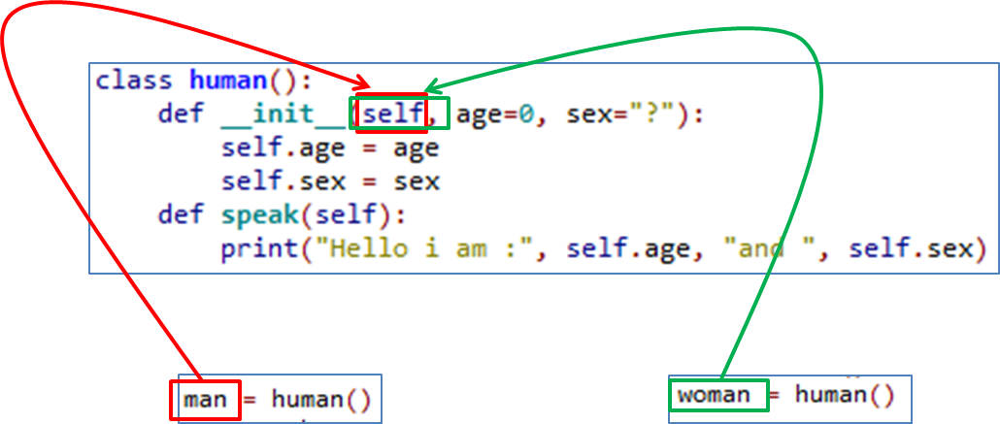

За допомогою self можна додати атрибути-дані. Наприклад, так, але зверніть увагу, що атрибут стане доступним лише після виклику методу. Такий спосіб додавання атрибутів не рекомендований. Атрибути можна додавати в тілі класу і методі __init__ про який ми поговоримо пізніше.

```py
class Student:

  def addName(self):
    self.name = "Alex"


s = Student()
#print(s.name) error
s.addName()
print(s.name)
```

## init

В об'єктно-орієнтованому програмуванні конструктором класу називають метод, який автоматично викликається при створенні об'єктів. Його також можна назвати конструктором об'єктів класу. Ім'я такого методу зазвичай регламентується синтаксисом конкретної мови програмування. Так в Java ім'я конструктора класу збігається з ім'ям самого класу. В Python ж роль конструктора грає метод ```__init__()```.

В Python наявність пар знаків підкреслення спереду і ззаду в імені методу говорить про те, що він належить до групи методів перевантаження операторів. При цьому методи перевантаження операторів не треба викликати по імені. Викликом для них є сам факт участі об'єкта в певній операції. У разі конструктора класу - це операція створення об'єкта. Так як об'єкт створюється в момент виклику класу по імені, то в цей момент викликається метод ```__init__()```, якщо він визначений в класі.

Необхідність конструкторів пов'язана з тим, що нерідко об'єкти повинні мати власні властивості відразу.

Розглянемо приклад Student. Для того щоб використовувати цей об'єкт його властивості потрібно ініціалізувати:

```py
class Student:

  def __init__(self, name, age, card):
    self.name = name
    self.age = age
    self.card = card

  def printStudentInfo(self):
    print(self.name + " " + str(self.age) + " " + str(self.card))


# s = Student() missing 3 required positional arguments: 'name', 'age', and 'card'
s = Student("Alex", 23, 18656561523)
s.printStudentInfo()
```

> Зверніть увагу, що ми створили атрибути - даних за допомогою self, але, оскільки, їх створення було в конструкторі - це цілком нормально.


## Перезавантаження операторів

Створимо клас:

```py
class A:

  def __init__(self, a):
    self.a = a
```

І спробуємо додати два його екземпляри:

```py
a = A(12)
b = A(4)
c = a + b
```

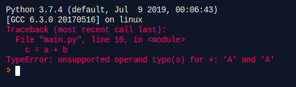

Справа в тім, що інтерпретатор python не знає як складати користувацькі класи. Але ми можему йому допомогти, використавши перезавантаження операторів.

Для цього на класі нам потрібно визначити необхідні методи в залежності від операції. Ось таблиця, яка показує відношення методу і оператора:

|Оператор|Метод|
|-|-|
|+|```__add__(self, other)```|
|–|```__sub__(self, other)```|
|*|```__mul__(self, other)```|
|/|```__truediv__(self, other)```|
|//|```__floordiv__(self, other)```|
|%|```__mod__(self, other)```|
|**|```__pow__(self, other)```|

Виправио наш клас A:

```py
class A:

  def __init__(self, a):
    self.a = a

  def __add__(self, other):
    return A(self.a + other.a)


a = A(12)
b = A(4)
c = a + b
print(c.a)
```

Тепер спробуємо порівняти наші об'єкти:

```py
class A:

  def __init__(self, a):
    self.a = a

  def __add__(self, other):
    return A(self.a + other.a)


a = A(12)
b = A(4)

if a > b:
  print("a > b")
```

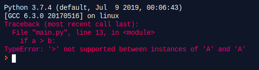

Справа в тім, що логічні оператори також можна перезавантажувати:

|Оператор|Метод|
|-|-|
|<|```__lt__(self, other)```|
|>|```__gt__(self, other)```|
|<=|```__le__(self, other)```|
|>=|```__ge__(self, other)```|
|==|```__eq__(self, other)```|
|!=|```__ne__(self, other)```|

```py
class A:

  def __init__(self, a):
    self.a = a

  def __add__(self, other):
    return A(self.a + other.a)

  def __gt__(self, other):
    if self.a > other.a:
      return True
    return False


a = A(12)
b = A(4)

if a > b:
  print("a > b")
```


Ось деякі інші оператори, які можна перезавантажувати:

|Оператор|Метод|
|-|-|
|-=|```__isub__(self, other)```|
|+=|```__iadd__(self, other)```|
|*=|```__imul__(self, other)```|
|/=|```__idiv__(self, other)```|
|//=|```__ifloordiv__(self, other)```|
|%=|```__imod__(self, other)```|
|**=|```__ipow__(self, other)```|
|unary -|```__neg__(self, other)```|
|unary +|```__pos__(self, other)```|
|~|```__invert__(self, other)```|


## object

В Python 3 всі об'єкти явно або неявно наслідуються від іншого класу object і наслідують всі його методи:

```py
class A:
  pass


class B(object):
  pass
```

В цих двох випадках класи A і B були в першому прикладі(неявно), а в другому - явно.

Одним з найбільш використовуваних методів класу object є метод ```__str__ ()```. Коли необхідно отримати строкове представлення об'єкту або вивести об'єкт у вигляді рядка, то Python якраз викликає цей метод. І при визначенні класу хорошою практикою вважається перевизначення цього методу.

```py
class Student:

  def __init__(self, name):
    self.name = name


s = Student("Alex")
print(s)
```

У бітьківському класі object вже визначена поведінка для методу ```__str___```. Тому результат ми побічимо, але для людини він буде мало інформативним.

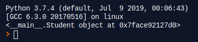

Ми можемо перевизначити цей метод:

```py
class Student:

  def __init__(self, name):
    self.name = name

  def __str__(self):
    return self.name

s = Student("Alex")
print(s)
```

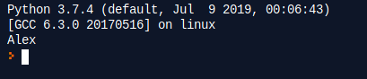

## static

В класах Python можуть існувати статичні поля і статичні методи. Їх можна викликати без створення екземпляра об'єкта і вони загальні для всіх екземплярів, тобто зберігаються в оголошенні класу.

Давайте розглянемо статичні атрибути - дані. Насправді, ми вже з Вами їх створювали. Всі змінні, які оголошені в самому класі є статичними і ми можо отримати до них доступ не створюючи екземпляр об'єкта:

```py
class A:

  a = 3


print(A.a)
```

Але, тут є підводні камні. Справа втім, що при такому оголошенні існує як статична змінна на класі так і динамічна всередині екземпляра:

```py
class A:

  a = 3


print(A.a)
a = A()
print(a.a)
A.a = 5
print(A.a)
print(a.a)
a.a = 7
print(A.a)
print(a.a)
```

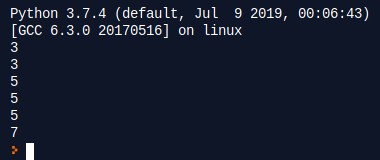

# Реалізація принципів ООП в Python

## Інкапсуляція

Читаючи різні статті на тему інкапсуляції, напевно ти стикався з тим, що в програмуванні є два поширених поняття - інкапсуляція і приховування. І під словом «інкапсуляція» автори розуміють то одне, то інше.

Початкове значення слова «інкапсуляція» в програмуванні - об'єднання даних і методів роботи з цими даними в одній упаковці («капсулі»).

В Python в ролі упаковки-капсули виступає клас. Клас містить в собі і дані (поля класу), і методи для роботи з цими даними.

Тепер поговоримо про приховування. 

Як же так виходить, що ми користуємося всякими складними механізмами без розуміння, як вони влаштовані і на чому заснована їхня робота? Все просто: їх творці надали простий і зручний інтерфейс.

На автоматі з газованою водою інтерфейс - це кнопки на панелі. Натиснувши одну кнопку, ти вибираєш обсяг склянки. Натиснувши другу, вибираєш сироп. Третя відповідає за додавання льоду. І це все, що тобі потрібно зробити.

Неважливо, як саме автомат влаштований всередині. Головне - він влаштований так, що для отримання газованої користувачеві потрібно натиснути три кнопки.

Те ж і з автомобілем. Неважливо, що там відбувається у нього всередині. Головне - при натисканні правої педалі автомобіль їде вперед, а при натисненні лівої - гальмує.

Саме в цьому полягає суть приховування. Всі «нутрощі» програми ховаються від користувача. Для нього ця інформація є зайвою, непотрібною. Користувачеві необхідний кінцевий результат, а не внутрішній процес.

Ось приклад інкапсуляції в Java, C++, C#, який досягається модифікаторами доступу private, public, protected:

```java
class Student {
  private String name;

  public Student(String name){
    this.name = name;
  }

  public void printName(){
    System.out.println(this.name);
  }
}

class Main {
  public static void main(String[] args) {
    Student s = new Student("Alex");
    // System.out.println(s.name); error
    s.printName();
  }
}
```

В цьому прикладі отримати доступ до приватної змінної name важко, так-як вона прихована від зовнішнього світу.

В python модифікаторів доступу немає, але використовується інший механізм.

Python 3 надає 3 рівня доступу до даних:

- публічний (public, немає особливого синтаксису);
- захищений (protected, одне нижнє підкреслення на початку назви, _);
- приватний (private, два нижніх підкреслення в початку назви, __).

```py
class Student:

  def __init__(self):
    self.publicName = 'Public Name'
    self._protectedName = 'Protected Name'
    self.__privateName = 'Private Name'

  def printName(self):
    print(self.__privateName)


s = Student()
print(s.publicName)
print(s._protectedName)
#print(s.__privateName) error
s.printName()
```

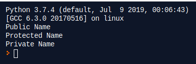

Поля без підкреслення можуть бути доступні звідусіль. Поля із двома підкресленнями доступні всередині класу. Поля зі одним підкресленням доступні лише для класів в одному модулі.

## Наслідування

Один клас може бути побудований на основі іншого, використовуючи принцип абстракції. Чим вище клас по ієрархії до кореня тим більше він абстрактний. І навпаки, чим дальше - тип більше він конкретна реалізація.

Розглянемо клас:

```py
class Kernel:

  def __init__(self, name, version):
    self.name = name
    self.version = version

  def boot(self):
    print('Botting kernel ', self.name, ' version ', self.version)


k = Kernel('Linux', '5.12')
k.boot()
```

Реалізовуючи новий мехінізм Kernel наприклад PanicMode, ми можемо оператися на вже існуючий клас:

```py
class KernelWithPanicMode(Kernel):

  def __init__(self, name, version, isPanicModeEnabled):
    super(KernelWithPanicMode, self).__init__(name, version)
    self.isPanicModeEnabled = isPanicModeEnabled


k = KernelWithPanicMode('Linux', '5.12', True)
k.boot()
```

Для того, щоб ініціалізувати дочірній клас потрібно ініціалізувати його батькіський клас викликом його конструктора, ось код, який це робить ```super(KernelWithPanicMode, self).__init__(name, version)```

По суті, ми створили KernelWithPanicMode на основі Kernel. В класі KernelWithPanicMode доступні всі атрибути і методи батьківського класу. Також клас KernelWithPanicMode, містить в собі не лише батьківські атрибути, але і додає свій isPanicModeEnabled.

Пошук атрибутів працює по ієрархії: якщо атрибут не знайдеться в поточному класі, пошук триває в базовому класі, і так далі за рекурсією. Дочірні класи можуть перевизначати методи базових класів - всі методи використовуються в цьому стилі віртуальними.

```py
class Kernel:

  def __init__(self, name, version):
    self.name = name
    self.version = version

  def boot(self):
    print('Botting kernel ', self.name, ' version ', self.version)


class KernelWithPanicMode(Kernel):

  def __init__(self, name, version, isPanicModeEnabled):
    super(KernelWithPanicMode, self).__init__(name, version)
    self.isPanicModeEnabled = isPanicModeEnabled

  def boot(self):
    super().boot()
    if self.isPanicModeEnabled:
      print('With panic mode')


k = KernelWithPanicMode('Linux', '5.12', True)
k.boot()
```

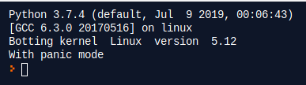

## Поліморфізм

Якщо говорити коротко, **поліморфізм** - це здатність застосовувати методи виробничого класу, який не існує на даний момент створеного базового. Для тих, хто не розуміється в ООП, це, наверно, звучить складно. Тому, розгляньмо застосування поліморфізму на прикладі.

Для цього доробимо приклад із секції "Інкапсуляціє" ще одним нащадком Kernel:

```py
class Kernel:

  def __init__(self, name, version):
    self.name = name
    self.version = version

  def boot(self):
    print('Botting kernel ', self.name, ' version ', self.version)


class KernelWithPanicMode(Kernel):

  def __init__(self, name, version, isPanicModeEnabled):
    super(KernelWithPanicMode, self).__init__(name, version)
    self.isPanicModeEnabled = isPanicModeEnabled

  def boot(self):
    super().boot()
    if self.isPanicModeEnabled:
      print('With panic mode')


class KernelWithSafeMode(Kernel):

  def __init__(self, name, version, isSafeModeEnabled):
    super(KernelWithSafeMode, self).__init__(name, version)
    self.isSafeModeEnabled = isSafeModeEnabled

  def boot(self):
    super().boot()
    if self.isSafeModeEnabled:
      print('With safe mode')
```

Перед тим як продемонструвати поліморфізм потрібно акцентувати увагу на тому, що **дочірній клас може бути приведений до типу батьківського класу**. На рівні коду, в приведеному типу залишаються лише атрибути батьківського класу, але фізично він залишається дочірнім класом із перевизначеним методом батьківського класу.

```py
if isinstance(k, Kernel):
  print('k instance of Kernel')
```

Тепер розробимо клас OS, для функціонування якого потрібне ядро.

```py
class OS:

  def __init__(self, kernel):
    if isinstance(kernel, Kernel):
      self.kernel = kernel
    else:
      print('Passed kernel does not supports')

  def start(self):
    print('Starting OS')
    self.kernel.boot()
```

Клас OS може прийняти будь-якого нащадка класу Kernel. На момент створення класу OS, невідомо який клас буде переданий. Дочірні класи Kernel визначають метод boot() по - своєму.

```py
k = KernelWithPanicMode('Linux', '5.12', True)
k1 = KernelWithSafeMode('Linux', '4.9', True)

os = OS(k)
os.start()

os1 = OS(k1)
os1.start()
```

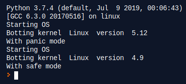

# unittest

Ідея, що лежить в основі модульного тестування, полягає в окремому тестуванні поведінки кожної самостійної одиниці програмного коду. Оскільки зараз програмний код в переважній більшості пишеться на об'єктно-орієнтованих мовах, то в якості "цеглинки" коду виступає написаний програмістом клас, а якщо переходити на ще більш глибокий рівень, то навіть не клас, а окремо взятий метод цього класу.

Підрозділ-тести для свого кода пішуть самі програмісти. Одним із переважних майнових модулів тестування є можливість виявлення помилок на ранніх етапах розробці самих розробників. Це, звичайно, декілька збільшує напругу на розробку, але можливо здорово витратити час на відкладення готового коду додатків, а також ще більше, ніж цілий ряд переробників, які ми обсуджуємо детальніше чуть нижче. Нужно сказати, що "писати одиничні тести" у нашому продвинутое в технологічній планеті час вовсе не відзначає писати їх досконало самостійно, що називається, "з нуля". Потомі, що існують у масовій формі, спеціалізуються на бібліотеках та фреймворках для тестування, в тому числі, якщо вони не на всі 100%, то за кращою мірою дуже і дуже важливо автоматично автоматизувати створені модульні тести для запропонованих, які пишуться на самих різних мовних програмах.

**unittest** - модуль, який вбудований в Python і використовується для написання автоматизованих тестів.

В основі unittest лежать так звані asserts:

|Method|Checks that|
|-|-|
|assertEqual(a, b)|a == b|
|assertNotEqual(a, b)|a != b|
|assertTrue(x)|bool(x) is True|
|assertFalse(x)|bool(x) is False|
|assertIs(a, b)|a is b|
|assertIsNot(a, b)|a is not b|
|assertIsNone(x)|x is None|
|assertIsNotNone(x)|x is not None|
|assertIn(a, b)|a in b|
|assertNotIn(a, b)|a not in b|
|assertIsInstance(a, b)|isinstance(a, b)|
|assertNotIsInstance(a, b)|not isinstnace(a, b)|
|assertGreater(a, b)|a > b|
|assertGreaterEqual(a, b)|a >= b|
|assertLess(a, b)|a < b|
|assertLessEqual(a, b)|a <= b|

і т.д.

Розглянемо приклад:

```py
import unittest

class TestStringMethods(unittest.TestCase):

  def test_upper(self):
      self.assertEqual('foo'.upper(), 'FOO')

  def test_isupper(self):
      self.assertTrue('FOO'.isupper())
      self.assertFalse('Foo'.isupper())

  def test_split(self):
      s = 'hello world'
      self.assertEqual(s.split(), ['hello', 'world'])
      with self.assertRaises(TypeError):
          s.split(2)

if __name__ == '__main__':
    unittest.main()
```

Тестовий випадок створюється шляхом успадкування від unittest.TestCase. 3 окремих тесту визначаються за допомогою методів, ім'я яких починається на test. Ця угода говорить виконавцю тестів про те, які методи є тестами.

Останні 2 рядки показують простий спосіб запуску тестів. unittest.main () надає інтерфейс командного рядка для тестування програми. Будучи запущеним з командного рядка, цей скрипт виводить звіт, подібний цьому:

```
...
----------------------------------------------------------------------
Ran 3 tests in 0.000s

OK
```

unittest може бути використаний з командного рядка для запуску модулів з тестами, класів або навіть окремих методів:

```bash
python -m unittest test_module1 test_module2
python -m unittest test_module.TestClass
python -m unittest test_module.TestClass.test_method
```

Можна також вказувати шлях до файлу:

```bash
python -m unittest tests/test_something.py
```

За допомогою прапора -v можна отримати більш детальний звіт:

```bash
python -m unittest -v test_module
```

```bash
test_isupper (__main__.TestStringMethods) ... ok
test_split (__main__.TestStringMethods) ... ok
test_upper (__main__.TestStringMethods) ... ok

----------------------------------------------------------------------
Ran 3 tests in 0.001s

OK
```

Склонуємо репозиторій [rpn](https://github.com/endlesskwazar/rpn_py.git)

і створимо директорію tests, а в ній TestPrChecker.py

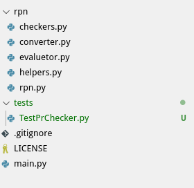

З наступним вмістом:

```py
import unittest

from rpn.checkers import check_pr


class TestPrChecker(unittest.TestCase):

    def test_pr_should_return_true(self):
        valid_pr = ['()', '([])']
        for vp in valid_pr:
            self.assertTrue(check_pr(vp))

    def test_pr_should_return_false(self):
        invalid_pr = ['(', '([)']
        for ip in invalid_pr:
            self.assertFalse(check_pr(ip))


if __name__ == '__main__':
    unittest.main()
```

Запустимо тести:

```bash
python -m unittest -v tests.TestPrChecker
```

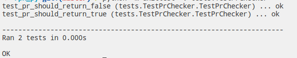

# Домашнє завдання

1. dsfs
2. sdfsd

# Контрольні запитання

1. Яка різниця між класом і об'єктом?
2. Для чого призначений метод ```__init__()```?
3. Що таке ключове слово self?
4. Поясніть принцип інкапсуляції і його реалізації в Python?
5. Поясніть принцип наслідування і його реалізації в Python?
6. Поясніть принцип поліморфізму і його реалізації в Python?
7. Для чого використовується модуль unittest