# Зміст

${toc}

# Exceptions

Розгляньмо функцію:

```py
def div(a, b):
  return a / b
```

А тепер уявімо, що вона була викликана із наступними параметрами:

```py
div(1,0)
```

В результаті програма викинула так - званий "exception" і впала:

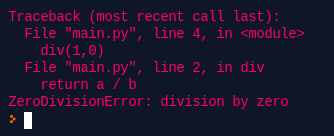


У Python є багато вбудованих винятків, які змушують вашу програму виводити помилку, коли щось у ній йде не так.

Коли ці винятки трапляються, вони змушують поточний процес стати на паузу і передає керування в місце виклику, доки виняток не буде оброблений. Якщо вийняток не обробити, наша програма вийде з ладу.

Як раз у прикладі із функцією div стався виняток, який ми не обробили, тому програма впала.

Як обробляти вийняток в Python?

У Python винятки можна обробляти за допомогою оператора try.

Критична операція, яка може викликати виняток, розміщується всередині try, а код, який обробляє виняток, записується в exept:

```py
try:
  div(1,0)
except:
  print('Something goes wrong')
```

Тепер наша програма не падає, але бентежить не інформативне повідомлення. Це можна виправити, якщо except блок буде приймати об'єкт вийнятку. Якщо ми його матимемо, ми зможему вивести більш інформативне повідомлення:

```py
try:
  div(1,0)
except Exception as e:
  print(e)
```

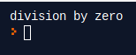

Уже краще, хоча Exception є батьківським класом для всіх можливих винятків, і виходить, що всі вийнятки ми будемо обробляти в одному контексті, що не дуже зручно. В execpt може вказуватися не лише Exception але і його дочірні класи:

```py
def div(a, b):
  return a / b

try:
  div(1,0)
except ZeroDivisionError as e:
  print(e)
```

І блок try може мати багато блоків exept, кожен із яких може обробляти конкретне виключення або їх групу:

```py
    try:
       # Критичний код
       pass
    except ValueError:
       # Обробляємо ValueError
       pass
    except (TypeError, ZeroDivisionError):
       # Обробляємо групу виключень
       # TypeError і ZeroDivisionError
       pass
    except:
       # Обробляємо інші виключення
       pass
```

У Python винятки виникають, коли під час виконання виникають відповідні помилки, але ми можемо самостійно їх викликати за допомогою ключового слова raise.

Ми також можемо передати допоміжній параметр для того, щоб уточнити причину винятку:

```py
def div(a, b):
  if b == 0:
    raise ZeroDivisionError('You passed zero f**king moron!!!')
  return a / b

try:
  div(1,0)
except ZeroDivisionError as e:
  print(e)
```

Як вже було сказано в Python є багато вбудованих винятків, які ми самостійно можемо використати при написанні власного коду:

|Виключення|Пояснення|
|-|-|
|ImportError|Піднімається, коли імпортований модуль не знайдено.|
|IndexError|Піднімається, коли індекс послідовності знаходиться поза діапазоном.|
|KeyError|Піднімається, коли ключ не знайдений у словнику.|
|MemoryError|Піднімається, коли операція закінчується пам'яттю.|
|TypeError|Піднімається, коли функція або операція застосована до об'єкта неправильного типу.|
|ValueError|Піднімається, коли функція отримує аргумент правильного типу, але неправильного значення.|

І т.д. Тобто ми можемо вибрати близьке нам виключення. Ми також можемо кинути загальне виключення, хоча це не найкращий варіант:

```py
def div(a, b):
  if b == 0:
    raise Exception('You passed zero f**king moron!!!')
  return a / b

try:
  div(1,0)
except Exception as e:
  print(e)
```

Якщо вбудованих винятків нам не вистачає, то ми можемо створити власний. Для цього достатньо створити клас. Цей клас має бути похідним, прямо чи опосередковано, від класу Exception. Більшість вбудованих винятків також походять із цього класу.

```py
class ZeroAfterDivisionException(Exception):
  pass

def division(a, b):
  res = a - b
  if res == 0:
    raise ZeroAfterDivisionException("Zeo after dividion")
  return res

try:
  division(1,1)
except ZeroAfterDivisionException as e:
  print(e)
```

Оператор try в Python може мати необов'язковий блок finally. Цей блок виконується завжди, і зазвичай використовується для звільнення зовнішніх ресурсів.

Наприклад, ми можемо бути підключені до віддаленого центру обробки даних через мережу або працювати з файлом або працювати з графічним інтерфейсом користувача (GUI).

У всіх цих обставинах ми повинні очистити ресурс, який ми використовували, незалежно від того, був він успішним чи ні. Ці дії (закриття файлу, графічний інтерфейс або відключення від мережі) виконуються в finally  для гарантії виконання.

```py
    try:
       f = open("test.txt",encoding = 'utf-8')
    finally:
       f.close()
```

# Decorators

За визначенням, **декоратор** - це функція, яка приймає іншу функцію і розширює поведінку останньої, не змінюючи її.

Почнимо із самого початку. В Python функції - first class citizens, що означає, що вони можуть бути причвоєнні змінній і передані як параметр в іншу функцію:

```py
def higher_order_func(func):
  print('executing higher order function')
  func()

def func():
  print('executing func')

higher_order_func(func)
```

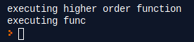

Також у функції можуть бути свої внутрішні функції, які вона може використовувати, але ззовні вони недоступні. Внутрішні функції можуть мати доступ до оточення зовнішньої функції, тобто до її параметрів і локальних змінних:

```py
def higher_order_func(func):
  print('executing higher order func')

  def inner_func():
    func()
    print('executing inner func')

  inner_func()

def func():
  print('executing func')

# inner_func() error
higher_order_func(func)
```

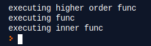

Хоча ззовні до внутрішньої функції достукатися не можна, вона можу бути повернута із самої функції, де вона була оголошена:

```py
def higher_order_func(func):
  print('executing higher order func')

  def inner_func():
    func()
    print('executing inner func')

  inner_func()
  return inner_func

def func():
  print('executing func')

# inner_func() error
res = higher_order_func(func)
print(res)
res()
```

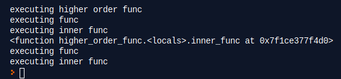

Тепер ближче до суті, уявімо, що є 2 або більше функцій перед або після, яких нам потрібно виконати, який код. Звісно, можна модифікувати вміст самих функцій, але це рішення містить в собі copy-paste, який в свою чергу є поганим рішенням. Тут нам і допоможуть декоратори:

```py
def my_decorator(func):
    def wrapper():
        print("Something is happening before the function is called.")
        func()
        print("Something is happening after the function is called.")
    return wrapper

def say_whee():
    print("Whee!")

say_whee = my_decorator(say_whee)
say_whee()
```

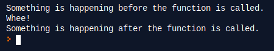

Перш ніж продовжувати, розглянемо другий приклад. Оскільки wrapper () - це звичайна функція Python, поведінка декоратора функції може динамічно змінюватися. Щоб не заважати сусідам, наступний приклад запускатиме лише декорований код протягом дня:

```py
from datetime import datetime

def not_during_the_night(func):
    def wrapper():
        if 7 <= datetime.now().hour < 22:
            func()
        else:
            pass  # Hush, the neighbors are asleep
    return wrapper

def say_whee():
    print("Whee!")

say_whee = not_during_the_night(say_whee)
```

Спосіб яким ми декорували say_whee () вище, трохи незграбний. Натомість Python дозволяє використовувати декоратори більш простим способом із символом @

```py
def my_decorator(func):
    def wrapper():
        print("Something is happening before the function is called.")
        func()
        print("Something is happening after the function is called.")
    return wrapper

@my_decorator
def say_whee():
    print("Whee!")

say_whee()
```


Тепер, яувімо, що функція, яку ми хочемо декорувати для виклику потребує передачі параметрів:

```py
def my_decorator(func):
    def wrapper():
        print("Something is happening before the function is called.")
        func()
        print("Something is happening after the function is called.")
    return wrapper

@my_decorator
def say_whee(name):
    print("Whee! ", name)

say_whee('Alex')
```

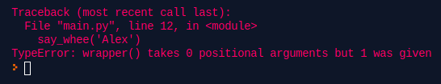

Рішення полягає у використанні *args та **kwargs у функції.

*args та **kwargs - це загальна ідіома, яка дозволяє функціям приймати довільну кількість аргументів.

*args дасть вам усі параметри функції як кортеж:

```py
def foo(*args):
  for a in args:
    print(a)

foo(1,2,3)
```

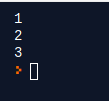

**kwargs дасть вам усі аргументи ключових слів, крім тих, що відповідають формальному параметру як словник.

```py
def bar(**kwargs):
  for a in kwargs:
   print (a, kwargs[a])

bar(name="alex", age=20)
```

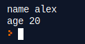

```py
def my_decorator(func):
    def wrapper(*args, **kwargs):
        print("Something is happening before the function is called.")
        func(*args, **kwargs)
        print("Something is happening after the function is called.")
    return wrapper

@my_decorator
def say_whee(name):
    print("Whee! ", name)

say_whee('Alex')
```

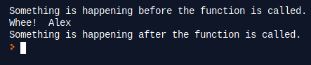

Декоратори можна застосовувати не лише на функціях, а також на методах класа:

```py
def my_decorator(func):
    def wrapper(*args, **kwargs):
        print("Something is happening before the function is called.")
        func(*args, **kwargs)
        print("Something is happening after the function is called.")
    return wrapper


class Student:

  def __init__(self, name):
    self.name = name

  @my_decorator
  def sayName(self):
    print(self.name)

s = Student('Alex')
s.sayName()
```

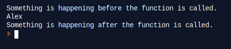

# Абстрактний клас

Уявімо собі клас, який стане загальим класом будівельним блоком для інших класів - WalkingCreature.

```py
class WalkingCreature:
  
  def walk(self):
    pass
```

Кожен нащадок повинен реалізувати метод walk в залежності від того, що він буде із себе представляти - ходе він на 1, 2, 3 і більше ногах чи лапах. А от реалізація методу walk в класу WalkingCreature взагалі не потрібна. Такі класи називаються абстрактними. В нашому прикладі нече метод walk і не має реалізації, насправді це не зовсім так:

```py
class WalkingCreature:
  
  def walk(self):
    pass


class Human(WalkingCreature):
  pass


a = WalkingCreature()
b = Human()
```

В результаті запуску код успішно відпрацював, хоча тут у ньому є дві проблеми:

- Ми можемо створити екземпляр класу, у якого не реалізваний метод
- Нащадок класу може і не реалізовувати наш абстрактний метод

Наш приклад доволі простий і насправді не має ніякого відношення до абстрактних класів. Насправді і сам Python немає ніякого механізму абстрактних класів. Для цього він використовує модуль, який називається ABSs.

```py
from abc import ABC, abstractclassmethod

class WalkingCreature(ABC):
  
  @abstractclassmethod
  def walk(self):
    pass


a = WalkingCreature()
```

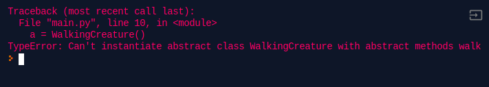

```py
from abc import ABC, abstractclassmethod

class WalkingCreature(ABC):
  
  @abstractclassmethod
  def walk(self):
    pass


class Human(WalkingCreature):
  pass


a = Human()
```

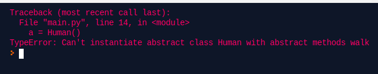

```py
from abc import ABC, abstractclassmethod

class WalkingCreature(ABC):
  
  @abstractclassmethod
  def walk(self):
    pass


class Human(WalkingCreature):
  
  def walk(self):
    print('walking on two legs')


a = Human()
a.walk()
```

# Mixins

Python одна із тих мов програмування, яка підтримує множинне наслідування:

```py
class A:

  def __init__(self, a):
    self.a = a


class B:

  def __init__(self, b):
    self.b = b


class C(A, B):

  def __init__(self, a, b, c):
    A.__init__(self, a)
    B.__init__(self, b)
    self.c = c


c = C(1,2,3)
print(c.a, c.b, c.c)
```

Але цим зловживати непотрібно, так-як множинне наслідування має свої недоліки:

1. Проблема ромба

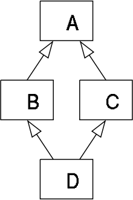

2. Важко представляти в пам'яті
3. Проблема вирішення конфліктів імен методів
4. І взагалі, код стає складно розуміти

Але в множинному наслідування Python є і хороша сторона - Mixins.

Mixin - клас, який не має даних, лише методи. З цих причин він не має методу ```__init__()``` і будь-який клас, який його неслідує не викликає super() конструктор для Mixin.

Міксин часто залежатиме від класу, який його успадковує, який має особливі атрибути, і їх, можливо, потрібно буде додати, якщо їх ще немає.

Розглянемо приклад:

```py
class DistanceToMixin:
    def distance_to_origin(self):
        return math.hypot(self.x, self.y)
    def distance_to(self, other):
        return math.hypot(self.x - other.x, self.y - other.y)

class PointD(DistanceToMixin):
    __slots__ = ("x", "y")
    def __init__(self, x=0, y=0):
        self.x = x
        self.y = y
    def manhattan_length(self, other=None):
        if other is None:
            other = self.__class__()
        return math.fabs(self.x - other.x) + math.fabs(self.y - other.y)
```

# Lambda

Подивимося на наступний приклад:

```py
def pass_me_a_helper_func_to_get_value(cb):
  a = cb()
  a += 33
  print('generated value from passed function', a)


def gen_calue():
  return 2

pass_me_a_helper_func_to_get_value(gen_calue)
```

Функція pass_me_a_helper_func_to_get_value приймає іншу функцію, для того щоб та згенерувала йому значення. Ця функція, яку ми передаємо, легко замінна, дось оголосити декілька таких функцій і замінити виклик із потрібною нам функцією. А що, якщо ці функції, які ми будемо передавати невеликого розміру, насправді їх тіло може бути 1 - 2 рядка. Нам всерівно потрібно оголосити кожного разу нову функцію, дати її ім'я, дотриматися всього синтаксису оголошення функцій, навіть якщо ця функція буде використана всього навсього один раз. Для цього якраз і існують lambda - вирази.

**Лямбда-вираз** — анонімна функція, яка підтримує стан між викликами і може отримати доступ до змінних зі своєї області видимості. Використовуючи лямбда-вирази, можна оголошувати функції в будь-якому місці коду.

Розгляньмо приклад звичайної функції Python:

```py
def identity(x):
    return x
```

і її еквівалент, використовуючи lambda - вирази:

```py
lambda x: x
```

В прикладі вище lambda - вираз складається із:

- ключового слова lambda
- параметри функції: x
- тіло функції: x

Оскільки lambda - функція анонімна(що означає, що в неї немає ім'я), в том вигляді як ми її створили вище викликати ми її не можемо, оскільки, в неї немає ідентифікатора.

Але lambda - функцію можна викликати відразу, при її створенні, оточивши її в дужки і передавши параметри:

```py
a = (lambda x: x+1)(2)
print(a)
```

Хоча lambda - функція анонімна, її можна присвоїти змінній, і використовувати цю змінну для доступу до функції:

```py
my_lambda = lambda x: x+1
print(my_lambda(2))
```

Еквівалент, вище наведеної lambda - функції:

```py
def my_lambda(x):
  return x + 1
```

Lambda - функція може прийняти 0, 1 і більше параметрів. Для цього, при оголошенні їх достатньо розділити комами:

```py
add_three_numbers = lambda a, b, c: a+b+c
print(add_three_numbers(1,2,3))

no_args = lambda:"no args lambda"
print(no_args())
```

Ось деякі обмеження lambda - функцій в python:

- lambda - функції можуть бути написані лише в одно строчку
- lambda - функції не підтримують type hinting

Як і звичайні функції lambda - функції підтримують різні способи оголошення і передачі аргументів:

- Позиційні аргументи
- Іменовані параметри
- Список параметрів
- Список ключів і параметрів
- Список лише ключів

```py
(lambda x, y, z: x + y + z)(1, 2, 3)
(lambda x, y, z=3: x + y + z)(1, 2)
(lambda x, y, z=3: x + y + z)(1, y=2)
(lambda *args: sum(args))(1,2,3)
(lambda **kwargs: sum(kwargs.values()))(one=1, two=2, three=3)
(lambda x, *, y=0, z=0: x + y + z)(1, y=2, z=3)
```

Розгляньмо ще один приклад:

```py
class MyList:

  def __init__(self, source):
    self.values = source

  def forEach(self, func):
    for val in self.values:
      func(val)

  def transform(self, func):
    for i, item in enumerate(self.values):
      self.values[i] = func(item)


source_list =  [1, 33, 2, 6, 7]
my_list = MyList(source_list)
print('before transform')
my_list.forEach(lambda x: print(x))
my_list.transform(lambda x: x * 2)
print('after transform')
my_list.forEach(lambda x: print(x))
```

# Домашнє завдання

# Контрольні запитання

1. Що таке вийнятки в Python?
2. Як обробляти виключення в Python?
3. Як створити власний вийняток в Python?
4. Що таке абстрактний клас? Як в Python створити абстрактний клас?
5. Що таке декоратори?
6. Що таке mixins? Як mixins відрізняються від звичайного множинного наслідування?