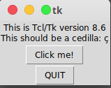

# Зміст

${toc}

# Tkinter

Tkinter (від англ. Tk interface) — багато-платформна графічна бібліотека інтерфейсів на основі засобів Tk (широко розповсюджена у світі GNU/Linux та інших UNIX подібних систем, портована в тому числі і на Microsoft Windows, Apple Mac OS), поширювана з відкритими вихідними текстами, написана Стіном Лумхольтом (Steen Lumholt) і Гвідо ван Россумом. Входить в стандартну бібліотеку Python.

Бібліотека Tkinter не реалізує власний інтерфейс до бібліотеки Tk, а забезпечує конвертування звернень Python в звернення Tcl - мови, яка тісно інтегрована з Tk. Таким чином Tkinter є обгорткою для Tcl/Tk.

# Установка

**Windows**:


**Debian & Ubuntu**:

```bash
```

**Arch**:

```bash
```

Перевірити правильність установки можна, виконавши наступну команду:

```bash
python -m tkinter
```



# Tkinter. Simple App

```py
from tkinter import Tk, BOTH
from tkinter.ttk import Frame


class Example(Frame):

    def __init__(self):
        super().__init__()

        self.initUI()

    def initUI(self):

        self.master.title("Simple")
        self.pack(fill=BOTH, expand=1)


def main():

    root = Tk()
    root.geometry("250x150+300+300")
    app = Example()
    root.mainloop()


if __name__ == '__main__':
    main()
```

```py
from tkinter import Tk, BOTH
from tkinter.ttk import Frame
```

Тут ми імпортуємо класи Tk і Frame, і константу BOTH. Клас Tk використовується для створення кореневого вікна. Frame - це контейнер для інших віджетів.

```py
class Example(Frame):

    def __init__(self):
        super().__init__()
```

Наш клас Example успадковує віджет контейнера Frame. У методі конструктора __init __ () ми називаємо конструктор базового класу класу.

```py
self.initUI()
```

Ми делегуємо створення інтерфейсу користувача методу initUI ().

```py
self.master.title("Simple")
```

Встановлюємо заголовок вікна методом title (). Атрибут master надає доступ до кореневого вікна (Tk).

```py
self.pack(fill=BOTH, expand=1)
```

Метод pack () - один із трьох менеджерів геометрії в Tkinter. Він упорядковує віджети по горизонталі та вертикалі. Тут ми поміщаємо віджет Frame, доступ до якого через атрибут self до кореневого вікна Tk. Вона розширена в обох напрямках. Іншими словами, він займає весь клієнтський простір кореневого вікна.

```py
root = Tk()
```

Корневе вікно - це головне вікно програм у наших програмах. У ньому є заголовок і рамки. Вони надаються менеджером вікон. Його потрібно створити перед будь-якими іншими віджетами.

```py
root.geometry("250x150+300+300")
```

Метод geometry () встановлює розмір вікна та розміщує його на екрані. Перші два параметри - ширина і висота вікна. Останні два параметри - це координати екрана x і y.

```py
root.mainloop()
```

Нарешті, ми входимо в основний цикл. Обробка події починається з цього моменту. Mainloop отримує події з віконної системи та передає їх у віджети програми. Він припиняється, коли ми натискаємо кнопку закриття заголовка або викликаємо метод quit ().

# Кнопка виходу

```py
from tkinter import Tk, BOTH
from tkinter.ttk import Frame, Button, Style


class Example(Frame):

    def __init__(self):
        super().__init__()

        self.initUI()

    def initUI(self):
        self.master.title("Quit button")
        self.pack(fill=BOTH, expand=1)

        quitButton = Button(self, text="Quit",
            command=self.quit)
        quitButton.place(x=50, y=50)


def main():

    root = Tk()
    root.geometry("250x150+300+300")
    app = Example()
    root.mainloop()


if __name__ == '__main__':
    main()
```

```py
quitButton = Button(self, text="Quit",
    command=self.quit)
```

Ми створюємо екземпляр віджета Button. Батьком цієї кнопки є контейнер Frame. Ми надаємо мітку для кнопки та команду. Команда вказує метод, який викликається, коли ми натискаємо кнопку. У нашому випадку називається метод quit(), який завершує роботу застосунка.

# Позиціонування


Існує два види віджетів: контейнери та їхні діти. Контейнери групують своїх дітей у певному порядку.

Tkinter має три вбудовані менеджери компонування: pack, grid, place. **Place** - використовує абсолютне позиціонування для розміщення своїх внутрішніх віджетів. **Pack** - різміщує свій вміст горизонтально, або вертикально один за одним. **Grid** - використовує 2-х вимірну сітку для позиціонування.

## Абсолютне позиціонування

У більшості випадків програмісти повинні використовувати менеджери компонування. Є кілька ситуацій, коли ми могли б використовувати абсолютне позиціонування. При абсолютному позиціонуванні програміст визначає положення та розмір кожного віджета в пікселях. Розмір і положення віджета не змінюються, якщо ми змінимо розмір вікна. Програми виглядають по-різному на різних платформах, і те, що в Linux виглядає нормально, може не виглядати нормально на Mac OS. Зміна шрифтів у нашому додатку може зіпсувати макет. Якщо ми перекладемо нашу програму на іншу мову, ми повинні переробити наш макет.

```py
from tkinter import Tk, BOTH
from tkinter.ttk import Frame, Button


class Example(Frame):

    def __init__(self):
        super().__init__()
        self.initUI()

    def initUI(self):

        self.master.title("Absolute positioning")
        self.pack(fill=BOTH, expand=1)
        btn1 = Button(self, text='BTN 1')
        btn1.place(x=50, y=50)
        btn2 = Button(self, text='BTN 2')
        btn2.place(x=150, y=50)
        btn3 = Button(self, text='BTN 3')
        btn3.place(x=100, y=150)


def main():

    root = Tk()
    root.geometry("300x280+300+300")
    app = Example()
    root.mainloop()


if __name__ == '__main__':
    main()
```

Основні параметри place():

- anchor (якір) - визначає частину віджета, для якої задаються координати. Принімає значення N, NE, E, SE, SW, W, NW або CENTER. За замовчуванням NW (верхній лівий угол).
- relwidth, relheight (відносна ширина і висота) - визначають розмір віджета в долях його батьківського віджета.
- relx, rely - визначають відносну позицію в батьківському віджеті. Координата (0; 0) - у лівого верхнього кута, (1; 1) - у правого нижнього.
- width, height - абсолютний розмір віджету в пікселях. Значення за замовчуванням (коли дані опції опущені) прирівнюються до природного розміру віджета, тобто до того, який визначається при його створенні і конфігурації.
- x, y - абсолютна позиція в пікселях. Значення за замовчуванням прирівнюються до нуля.

## pack - менеджер

## grid - менеджер

# Основні віджети

# Приклад

# Домашнє завдання

# Контрольні запитання

1. фіва
2. фіва
3. фів
4. іва
5. іва


