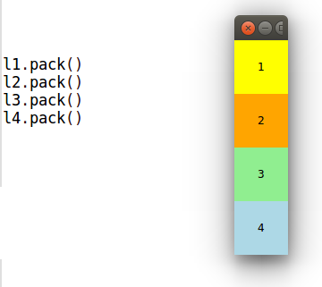
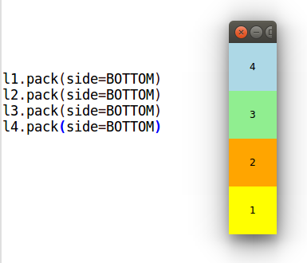
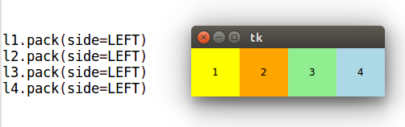
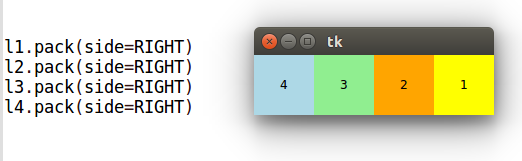
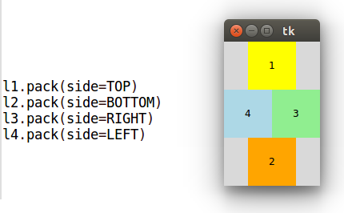
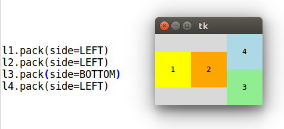
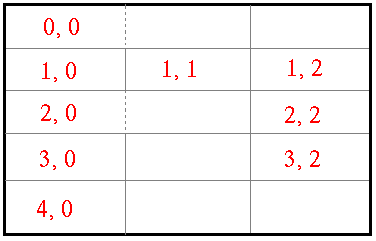

# Зміст

${toc}

# Tkinter

Tkinter (від англ. Tk interface) — багато-платформна графічна бібліотека інтерфейсів на основі засобів Tk (широко розповсюджена у світі GNU/Linux та інших UNIX подібних систем, портована в тому числі і на Microsoft Windows, Apple Mac OS), поширювана з відкритими вихідними текстами, написана Стіном Лумхольтом (Steen Lumholt) і Гвідо ван Россумом. Входить в стандартну бібліотеку Python.

Бібліотека Tkinter не реалізує власний інтерфейс до бібліотеки Tk, а забезпечує конвертування звернень Python в звернення Tcl - мови, яка тісно інтегрована з Tk. Таким чином Tkinter є обгорткою для Tcl/Tk.

# Установка

**Windows**:


**Debian & Ubuntu**:

```bash
```

**Arch**:

```bash
```

Перевірити правильність установки можна, виконавши наступну команду:

```bash
python -m tkinter
```


# Tkinter. Simple App

```py
from tkinter import Tk, BOTH
from tkinter.ttk import Frame


class Example(Frame):

    def __init__(self):
        super().__init__()

        self.initUI()

    def initUI(self):

        self.master.title("Simple")
        self.pack(fill=BOTH, expand=1)


def main():

    root = Tk()
    root.geometry("250x150+300+300")
    app = Example()
    root.mainloop()


if __name__ == '__main__':
    main()
```

```py
from tkinter import Tk, BOTH
from tkinter.ttk import Frame
```

Тут ми імпортуємо класи Tk і Frame, і константу BOTH. Клас Tk використовується для створення кореневого вікна. Frame - це контейнер для інших віджетів.

```py
class Example(Frame):

    def __init__(self):
        super().__init__()
```

Наш клас Example успадковує віджет контейнера Frame. У методі конструктора __init __ () ми називаємо конструктор базового класу класу.

```py
self.initUI()
```

Ми делегуємо створення інтерфейсу користувача методу initUI ().

```py
self.master.title("Simple")
```

Встановлюємо заголовок вікна методом title (). Атрибут master надає доступ до кореневого вікна (Tk).

```py
self.pack(fill=BOTH, expand=1)
```

Метод pack () - один із трьох менеджерів геометрії в Tkinter. Він упорядковує віджети по горизонталі та вертикалі. Тут ми поміщаємо віджет Frame, доступ до якого через атрибут self до кореневого вікна Tk. Вона розширена в обох напрямках. Іншими словами, він займає весь клієнтський простір кореневого вікна.

```py
root = Tk()
```

Корневе вікно - це головне вікно програм у наших програмах. У ньому є заголовок і рамки. Вони надаються менеджером вікон. Його потрібно створити перед будь-якими іншими віджетами.

```py
root.geometry("250x150+300+300")
```

Метод geometry () встановлює розмір вікна та розміщує його на екрані. Перші два параметри - ширина і висота вікна. Останні два параметри - це координати екрана x і y.

```py
root.mainloop()
```

Нарешті, ми входимо в основний цикл. Обробка події починається з цього моменту. Mainloop отримує події з віконної системи та передає їх у віджети програми. Він припиняється, коли ми натискаємо кнопку закриття заголовка або викликаємо метод quit ().

# Кнопка виходу

```py
from tkinter import Tk, BOTH
from tkinter.ttk import Frame, Button, Style


class Example(Frame):

    def __init__(self):
        super().__init__()

        self.initUI()

    def initUI(self):
        self.master.title("Quit button")
        self.pack(fill=BOTH, expand=1)

        quitButton = Button(self, text="Quit",
            command=self.quit)
        quitButton.place(x=50, y=50)


def main():

    root = Tk()
    root.geometry("250x150+300+300")
    app = Example()
    root.mainloop()


if __name__ == '__main__':
    main()
```

```py
quitButton = Button(self, text="Quit",
    command=self.quit)
```

Ми створюємо екземпляр віджета Button. Батьком цієї кнопки є контейнер Frame. Ми надаємо мітку для кнопки та команду. Команда вказує метод, який викликається, коли ми натискаємо кнопку. У нашому випадку називається метод quit(), який завершує роботу застосунка.

# Позиціонування


Існує два види віджетів: контейнери та їхні діти. Контейнери групують своїх дітей у певному порядку.

Tkinter має три вбудовані менеджери компонування: pack, grid, place. **Place** - використовує абсолютне позиціонування для розміщення своїх внутрішніх віджетів. **Pack** - різміщує свій вміст горизонтально, або вертикально один за одним. **Grid** - використовує 2-х вимірну сітку для позиціонування.

## Абсолютне позиціонування

У більшості випадків програмісти повинні використовувати менеджери компонування. Є кілька ситуацій, коли ми могли б використовувати абсолютне позиціонування. При абсолютному позиціонуванні програміст визначає положення та розмір кожного віджета в пікселях. Розмір і положення віджета не змінюються, якщо ми змінимо розмір вікна. Програми виглядають по-різному на різних платформах, і те, що в Linux виглядає нормально, може не виглядати нормально на Mac OS. Зміна шрифтів у нашому додатку може зіпсувати макет. Якщо ми перекладемо нашу програму на іншу мову, ми повинні переробити наш макет.

```py
from tkinter import Tk, BOTH
from tkinter.ttk import Frame, Button


class Example(Frame):

    def __init__(self):
        super().__init__()
        self.initUI()

    def initUI(self):

        self.master.title("Absolute positioning")
        self.pack(fill=BOTH, expand=1)
        btn1 = Button(self, text='BTN 1')
        btn1.place(x=50, y=50)
        btn2 = Button(self, text='BTN 2')
        btn2.place(x=150, y=50)
        btn3 = Button(self, text='BTN 3')
        btn3.place(x=100, y=150)


def main():

    root = Tk()
    root.geometry("300x280+300+300")
    app = Example()
    root.mainloop()


if __name__ == '__main__':
    main()
```

Основні параметри place():

- anchor (якір) - визначає частину віджета, для якої задаються координати. Принімає значення N, NE, E, SE, SW, W, NW або CENTER. За замовчуванням NW (верхній лівий угол).
- relwidth, relheight (відносна ширина і висота) - визначають розмір віджета в долях його батьківського віджета.
- relx, rely - визначають відносну позицію в батьківському віджеті. Координата (0; 0) - у лівого верхнього кута, (1; 1) - у правого нижнього.
- width, height - абсолютний розмір віджету в пікселях. Значення за замовчуванням (коли дані опції опущені) прирівнюються до природного розміру віджета, тобто до того, який визначається при його створенні і конфігурації.
- x, y - абсолютна позиція в пікселях. Значення за замовчуванням прирівнюються до нуля.

## pack - менеджер


У методу pack () є параметр side (сторона), який приймає одне з чотирьох значень-констант tkinter - TOP, BOTTOM, LEFT, RIGHT (верх, низ, ліво, право). За замовчуванням, коли в pack () не вказується side, його значення дорівнює TOP. Через це віджети розташовуються вертикально.


розглянемо різні комбінації значень параметру side:













Наступні дві властивості - fill (заповнення) і expand (розширення). За замовчуванням expand дорівнює нулю (інше значення - одиниця), а fill - NONE (інші значення BOTH, X, Y).

```py
from tkinter import Tk, RIGHT, BOTH, RAISED
from tkinter.ttk import Frame, Button, Style


class Example(Frame):

    def __init__(self):
        super().__init__()
        self.initUI()

    def initUI(self):

        self.master.title("Buttons")
        frame = Frame(self, relief=RAISED, borderwidth=1)
        frame.pack(fill=BOTH, expand=True)

        self.pack(fill=BOTH, expand=True)

        closeButton = Button(self, text="Close")
        closeButton.pack(side=RIGHT, padx=5, pady=5)
        okButton = Button(self, text="OK")
        okButton.pack(side=RIGHT)


def main():

    root = Tk()
    root.geometry("300x200+300+300")
    app = Example()
    root.mainloop()


if __name__ == '__main__':
    main()
```

У нас є два фрейми. Є базовий фрейм і додатковий фрейм, який розширюється в обидва боки і витісняє дві кнопки до нижньої частини базового фрейму. Кнопки розміщуються в горизонтальній коробці і розміщуються праворуч від цього поля.


## grid - менеджер

Табличний спосіб розміщення кращий через його гнучкості і зручності, коли справа доходить до розробки щодо складних інтерфейсів. Grid дозволяє уникнути використання безлічі фреймів, що неминуче в разі пакувальника Pack.

При розміщенні віджетів методом grid () батьківський контейнер (зазвичай це вікно) умовно поділяється на осередки подібно таблиці. Адреса кожного осередку складається з номера рядка і номера стовпчика. Нумерація починається з нуля. Осередки можна об'єднувати як по вертикалі, так і по горизонталі.



За допомогою методів columnconfigure() і rowconfigure() на бітьківському віджеті ми можемо створювати розмітку таблиці.

columnconfigure()/rowconfigure():

- minsize - мінімальна ширина/висота рядка/стовпця.
- weight - "вага" рядка/стовпця при збільшенні розміру віджета. 0 означає, що рядок/стовпець не розширюватиметься. Рядок/стовпець з "вагою" рівним 2 буде розширюватися вдвічі швидше, ніж з вагою 1.
- uniform - об'єднання рядків/стовпців в групи. Рядки/стовпці мають однаковий параметр uniform будуть розширюватися строго у відповідності зі своїм вагою.
- pad - розмір відступів. Вказує, скільки простору буде додано до найбільшого віджету в рядку/стовпці.

Щоб позиціонувати віджети в таблиці достатньов иконати метод grid() на віджеті.

grid():

- віав
- іва
- іва

```py
from tkinter import Tk, W, E
from tkinter.ttk import Frame, Button, Entry, Style

class Example(Frame):


    def __init__(self):
        super().__init__()
        self.initUI()

    def initUI(self):

        self.master.title("Calculator")

        Style().configure("TButton", padding=(0, 5, 0, 5),
            font='serif 10')

        self.columnconfigure(0, pad=3)
        self.columnconfigure(1, pad=3)
        self.columnconfigure(2, pad=3)
        self.columnconfigure(3, pad=3)

        self.rowconfigure(0, pad=3)
        self.rowconfigure(1, pad=3)
        self.rowconfigure(2, pad=3)
        self.rowconfigure(3, pad=3)
        self.rowconfigure(4, pad=3)

        entry = Entry(self)
        entry.grid(row=0, columnspan=4, sticky=W+E)
        cls = Button(self, text="Cls")
        cls.grid(row=1, column=0)
        bck = Button(self, text="Back")
        bck.grid(row=1, column=1)
        lbl = Button(self)
        lbl.grid(row=1, column=2)
        clo = Button(self, text="Close")
        clo.grid(row=1, column=3)
        sev = Button(self, text="7")
        sev.grid(row=2, column=0)
        eig = Button(self, text="8")
        eig.grid(row=2, column=1)
        nin = Button(self, text="9")
        nin.grid(row=2, column=2)
        div = Button(self, text="/")
        div.grid(row=2, column=3)

        fou = Button(self, text="4")
        fou.grid(row=3, column=0)
        fiv = Button(self, text="5")
        fiv.grid(row=3, column=1)
        six = Button(self, text="6")
        six.grid(row=3, column=2)
        mul = Button(self, text="*")
        mul.grid(row=3, column=3)

        one = Button(self, text="1")
        one.grid(row=4, column=0)
        two = Button(self, text="2")
        two.grid(row=4, column=1)
        thr = Button(self, text="3")
        thr.grid(row=4, column=2)
        mns = Button(self, text="-")
        mns.grid(row=4, column=3)

        zer = Button(self, text="0")
        zer.grid(row=5, column=0)
        dot = Button(self, text=".")
        dot.grid(row=5, column=1)
        equ = Button(self, text="=")
        equ.grid(row=5, column=2)
        pls = Button(self, text="+")
        pls.grid(row=5, column=3)
        
        self.pack()


def main():

    root = Tk()
    app = Example()
    root.mainloop()


if __name__ == '__main__':
    main()
```

За допомогою методів grid_remove () і grid_forget () можна зробити віджет невидимим. Відмінність між цими методами лише в тому, що grid_remove () запам'ятовує попереднє положення віджету. Тому для його відображення в колишньої осередки досить застосувати grid () без аргументів. Після grid_forget () буде потрібно заново конфігурувати положення віджету.

Приховування віджетів буває необхідно в тих випадках, коли, наприклад, від вибору користувача в одній частині інтерфейсу залежить, які віджети з'являться в інший.

# Основні віджети

## label

## button

## Checkbutton

## Scale

## Listbox

## Combobox

## Entry

# Приклад

# Домашнє завдання

Розробіть GUI для RPN, який був розроблений в лабораторній роботі №5.

# Контрольні запитання

1. Що таке Tkinter?
2. Що потрібно для того, щоб почати розробляти додатки з використанням Tkinter
3. Поясніть абсолютне позиціонування, використовуючи place.
4. Поясніть менеджери компонування pack і grid.


