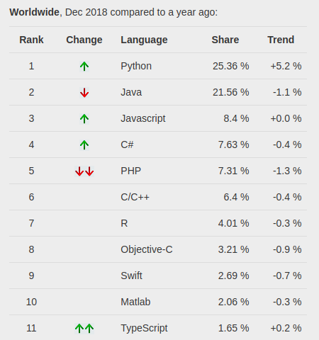
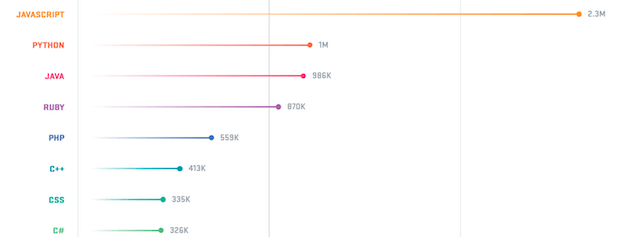
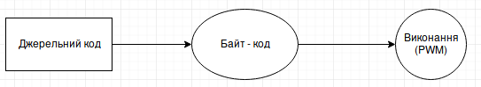
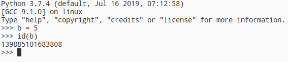
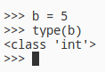

# Зміст

${toc}

# Історія і мотивація до вивчення

## Мотивація до вивчення

TIOBE індекс (рейтинг мов програмування) — показник популярності мов програмування. Розраховується виходячи з кількості результів запитів до пошукових систем, що містять назву мови.


PYPL(PopularitY of Programming Language) index is created by analyzing how often language tutorials are searched.



Here are the most popular programming languages used at Github.



## Області застосування

Python - це дуже універсальна мова програмування, з плеядою користувачів у всіх можливих сферах від програмування мікроконтроллерів до розробки мобільних додатків, але сфери в яких python дійсно хорошо себе показує це:
- веб - розробка
- data science: машинне навчання, аналіз даних і візуалізація
- автоматизація процесів

## Історія

сторія мови програмування Python почалася в кінці 1980-х. Гвідо ван Россум задумав Python в 1980-х роках, а приступив до його створення в грудні 1989 року в центрі математики та інформатики в Нідерландах. Мова Python був задуманий як нащадок мови програмування ABC, здатний до обробки виключень і взаємодії з операційною системою Амеба. Ван Россум є основним автором Python і продовжував виконувати центральну роль в ухваленні рішень щодо розвитку мови аж до 12 липня 2018 года.

Версія Python 2.0 була випущена 16 жовтня 2000 року і включала в себе багато нових великих функцій - таких як повний збирач сміття і підтримка Unicode. Однак найбільш важливим з усіх змін була зміна самого процесу розвитку мови і перехід на більш прозорий процес його створення.

Перша обернено-несумісна версія Python 3.0 була випущена 3 грудня 2008 року після тривалого періоду тестування. Багато її функції були перенести в обернено-сумісні Python 2.6 і Python 2.7.

Планувалося, що версії Python 2.x і Python 3.x будуть співіснувати паралельно протягом декількох релізів. Версія 2.x, головним чином, для сумісності з існуючими додатками, і c портированием в неї деяких можливостей 3.x. Python 2.6 був випущений як відповідний Python 3.0 і включав ряд його можливостей, а також режим «попередження», в якому підсвічувалася функціональність, віддалена в 3.x. Подібним же чином, Python 2.7 відповідав і включав функціональність Python 3.1, випущеного 26 червня 2009 року. Python 2.7 був останнім релізом 2.x: паралельні релізи припинилися на Python 3.2.

Таким чином зараз є дві існуючі поставки python 2.x(остання 2.7) і python 3.x(3.8 на момент написання).

# Як працює Python

Python - це мова програмування, яка виконується інтерпретатором. **Інтерпретатор** - це така програма, яка виконує інші програми. Коли ви пишете програму на мові Python, інтерпретатор читає вашу програму і виконує містяться в ній інструкції. Насправді, інтерпретатор - це шар програмної логіки між вашим програмним кодом і апаратурою вашого комп'ютера.

Але спочатку перед тим як інтерпретатор може виконувати код виконується компіляція в байт - код. Байт - код - це низькорівневе, платформно - незалежне уявлення вихідного тексту програми. Python транслює кожну інструкцію в вихідному коді сценарію в групи інструкцій байт-коду для підвищення швидкості виконання програми, так як байт-код виконується набагато швидше. Після компіляції в байт-код, створюється файл з розширенням ".pyc" по сусідству з вихідним текстом сценарію.

Наступного разу, коли ви запустите свою програму інтерпретатор мине етап компіляції і віддасть на виконання відкомпільований файл з розширенням ".pyc". Однак, якщо ви змінили вихідні тексти вашої програми, то знову відбудеться етап компіляції в байт-код, так як Python автоматично стежить за датою зміни файлу з вихідним кодом.

Якщо Python виявиться не в змозі записати файл з байт-кодом, наприклад через відсутність прав на запис на диск, то програма не постраждає, просто байт-код буде зібраний в пам'яті і при завершенні програми звідти вилучено.

Байт - код виглядає наступним чином:

```python
def hello()
    print("Hello, World!")
```

```
0 LOAD_GLOBAL              0 (print)
2 LOAD_CONST               1 ('Hello, World!')
4 CALL_FUNCTION            1
```

Після того як пройде процес компіляції, байт-код передається механізму під назвою віртуальна машина, яка і виконає інструкції з байт-коду. **Віртуальна машина** - це механізм часу виконання, вона завжди присутня в складі системи Python і це крайня складова системи під назвою "Інтерпретатор Python".



Програмісти, які мають досвід роботи з такими мовами як C і C ++, можуть помітити деякі відмінності в моделі виконання Python. Перше - це відсутність етапу складання або виклику утиліти "make", програми на Python можуть бути відразу ж запущені після написання вихідного коду. Друга відмінність - байт-код не є двійковим машинним кодом (наприклад інструкції для мікропроцесора Intel), він є внутрішнім поданням представленням на мові Python.

З цих причин програми на Python не можуть виконуватися також швидко як на C/C ++. Обхід інструкцій виконує віртуальна система, а не мікропроцесор, і щоб виконати байт-код, необхідна додаткова інтерпретація, інструкції якій вимагають більшого часу, ніж машинні інструкції мікропроцесора.

# Особливості синтаксису

Особливості синтаксису python полягають в тому, що на відміну від таких мов як C/C++, Java, JavaScript, Java контекст коду визначається не фігурними дужками, а рівнями відступу.

Наприклад:

c++:
```cpp
if (a == 3) {
//if scope
}
```

python
```python
if a == 3:
  //ident if scope
```

> Ще однією особливістю є те, що нам не потрібно ставити крапку з комою(;) в кінці виразу.

# Установка і запуск

# Типи даних

Якщо досить формально підходити до питання про типізацію мови Python, то можна сказати, що він відноситься до мов з неявною сильною динамічною типізацією.

Неявна типізація означає, що при оголошенні змінної вам не потрібно вказувати її тип, при явній - це робити необхідно. Як приклад мов з явною типизацией можна привести Java, C++. Ось як буде виглядати оголошення цілочисельний змінної в Java і Python.

java:
```java
int a = 1;
```

python:
```python
a = 1
```

Сильна типізація не дозволяє проводити операції у виразах з даними різних типів, слабка - дозволяє. У мовах з сильною типізацією ви не можете складати наприклад рядки і числа, потрібно все приводити до одного типу. До першої групи можна віднести Python, Java, до другої - С/С++, javascript.

В python існують наступні вбудовані типи даних(Жирним виділені, ті які ми зараз роглянемо. Інші типи - в наступних лекціях):
1. **None**
2. **Логічні (Boolean)**
3. **Числа**
    1. int
    2. float
    3. complex
4. Списки
    1. **list**
    2. tuple
    3. range
5. **Строка str**
6. Бінарні списки
    1. bytes
    2. bytearray
    3. memoryview
7. Множини
    1. set
    2. frozenset
8. Словник(dict)

## Модель даних

Створимо і ініціалізуємо нову змінну:

```py
b = 5
```

Цілочисельне значення 5 в рамках мови Python по суті своїй є об'єктом. Об'єкт, в даному випадку - це абстракція для представлення даних, дані - це числа, списки, рядки і т.п.

Кожен об'єкт має три атрибути - це ідентифікатор, значення і тип. Ідентифікатор - це унікальна ознака об'єкта, що дозволяє відрізняти об'єкти один від одного, а значення - безпосередньо інформація, що зберігається в пам'яті, якою управляє інтерпретатор.

При ініціалізації змінної, на рівні інтерпретатора, відбувається наступне:
- створюється цілочисельний об'єкт 5 (можна уявити, що в цей момент створюється комірка і 5 кладеться в цю комірку);
- даний об'єкт має певний ідентифікатор, значення: 5, і тип: ціле число;
- за допомогою оператора "=" створюється посилання між змінної b і цілочисельним об'єктом 5 (змінна b посилається на об'єкт 5).

Для того, щоб подивитися на об'єкт з яким ідентифікатором посилається дана змінна, можна використовувати функцію id ():

```python
b = 5
id(5)
```



Розгляньмо інший приклад:
```py
>>> a = 4
>>> b = 5
>>> id(a)
1829984576
>>> id(b)
1829984592
>>> a = b
>>> id(a)
1829984592
```

Як видно з прикладу, спочатку змінна a посилається на об'єкт 4 з ідентифікатором 1829984576, змінна b - на об'єкт з id = 1829984592. Після виконання операції присвоювання a = b, змінна a стала посилатися на той самий об'єкт, що і b.


Тип змінної можна визначити за допомогою функції type (). Приклад використання наведено нижче:



???????????????????????? here about imutable and mutable

???????????????????????? here about other types

# Списки

# str

# Умовні оператори

Умовна інструкція if-elif-else (її ще іноді називають оператором розгалуження) - основний інструмент вибору в Python. Простіше кажучи, вона вибирає, яку дію слід виконати, в залежності від значення змінних в момент перевірки умови.

Загальна форма запису умовної інструкції if виглядає наступним чином:

```py
if test1:
    state1
elif test2:
    state2
else:
    state3
```

або:

```py
if a:
  print("a");
else:
  if b:
    print("b")
  else:
    print("None")
```

## Перевірка на True

- Будь-яке число, не рівне 0, або непорожній об'єкт - істина.
- Числа, рівні 0, порожні об'єкти і значення None - брехня

## Логічні оператори

```py
X and Y
```

Істина, якщо обидва значення X і Y істинні.

```py
X or Y
```

Істина, якщо хоча б одне зі значень X або Y істинно.

```py
not X
```

Істина, якщо X брехня.

## Тернарний оператор

Наступна інструкція:
```py
if X:
    A = Y
else:
    A = Z
```

досить коротка, але, тим не менше, займає цілих 4 рядки. Спеціально для таких випадків і був придуманий тернарний оператор:

```py
A = Y if X else Z
```

# Цикли

# Особливості print, input

Функція **print()** виводить задані об'єкти на стандартний пристрій виводу (екран) або відправляє їх текстовим потоком в файл.

Повний синтаксис функції print ():
```py
print(*objects, sep=' ', end='n', file=sys.stdout, flush=False)
```

Де:
- objects - об'єкт, який потрібно вивести * позначає, що об'єктів може бути кілька;
- sep - розділяє об'єкти. Значення за замовчуванням: ' ';
- end - ставиться після всіх об'єктів;
- file - очікується об'єкт з методом write (string). Якщо значення не задано, для виведення об'єктів використовується файл sys.stdout;
- flush - якщо задано значення True, потік примусово скидається в файл. Значення за замовчуванням: False.

> Примітка: sep, end, file і flush - це аргументи-ключові слова. Якщо хочете скористатися аргументом sep, використовуйте:

```py
print(*objects, sep = 'separator')
```

Приклад виведення одного об'єкта:

```py
print('text')
```

Приклад виведення декількох об'єктів:

```py
print('text1', 'text2', 'text3')
```

Приклад виведення декількох об'єктів, використовуючи tab в якості роздільника:

```py
print("text1", "text2", "text3", sep = '\t')
```

Приклад виведення декількох об'єктів, використовуючи tab в якості роздільника і крапки в якості останього символу:

```py
print("text1", "text2", "text3", sep = '\t', end = '.')
```

Приклад запису у файл:

??????????????????????? heres example

Функція **input()**

# Домашнє завдання

# Контрольні запитання

1. sdf
2. sdfsd
3. sdfds
4. sdfds
5. sdfsd
6. sdfsd
7. sdfs
8. sdfsd
9. dfs
10. sdfsd